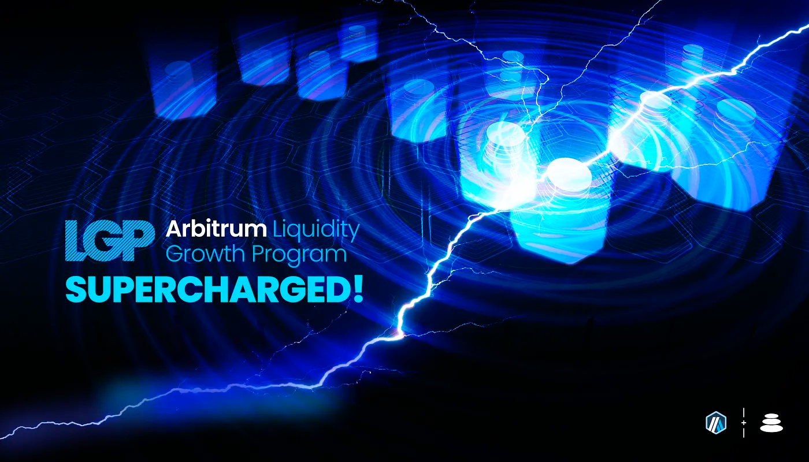
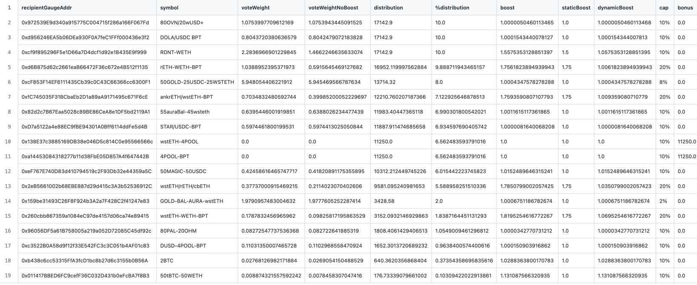
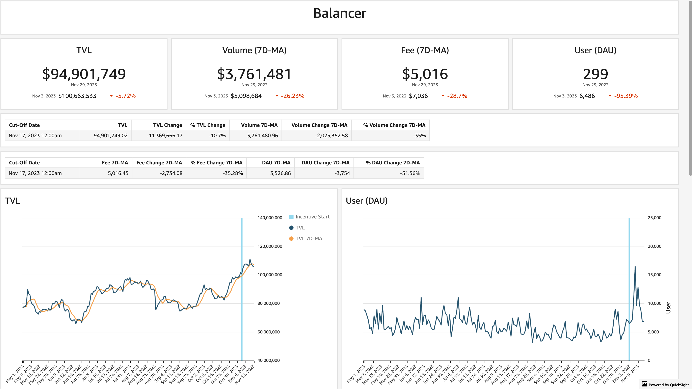
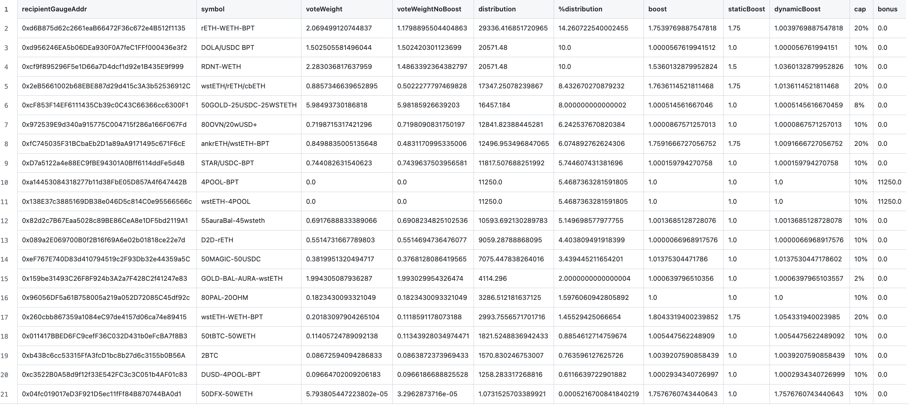

As per the STIP rules all protocols must post bi-weekly forum updates. The first updates will be due by next Friday, December 1st at 12:00PM EST

# Balancer Bi-Weekly Update 01-12-2023

## Recap of the Previous Two Weeks

**ARB Received Last Disbursement:** 342,858 (KYC delays resulted in collecting 2 biweekly payments at the start of the program, details in change section below)

**ARB Utilized as Incentives in the Last Two Weeks: [171,429](https://arbiscan.io/tx/0x062eac303ad41cb62bac8dd7acd69d092c5050a2804bd1ac980efe75b4644a91)

**Contracts incentivized over the last 2 weeks:** A CSV of incentived along with details about $ARB flows to each one and how they were calculated can be found [here](https://github.com/BalancerMaxis/data_automation/blob/main/notebooks/arb_dao_grant_distribution/output/dao_grant_2023-11-02_2023-11-16.csv).
These amounts of payment were queued and the required 171,429 $ARB sent for payment by this [multisig transaction](https://app.onchainden.com/safes/arb1:0xb6BfF54589f269E248f99D5956f1fDD5b014D50e/transactions/0xb5c2d7db571bce5c5fcd41ad5a02ca5d91f7f3e4ae5ca46cc4d1c81ea784ab06?nid=200179) executed at 16:14 UTC on Friday November 17th.
These payments will be streamed to stakers in the gauge by the injector and the gauge system for 2 weeks, ending today on December 1st.

**Contract address label [Form](https://docs.google.com/forms/d/e/1FAIpQLSd2AYnjAaQjVOLtvemZpsWoN5sTJEJ8dLqdRDExTBQv_SUeug/viewform) completed for all addresses:** [Insert Yes once Completed]

**ARB left over:** 171,429

**Plan for leftover ARB:** Increase biweekly amount distrbuted to 205,714.8 for the remaining periods. This brings us close to the weekly amounts we had proposed in our original STIP proposal before reducing amounts. This will increase the upward trajectory on TVL and volume on Balancer while creating stickiness for the network. We are expecting a compounding partnership with Plutus and Radiant via plsRDNT to be a large driver of growth using these incentives in the upcoming weeks. 
https://x.com/PlutusDAO_io/status/1728117332579610772?s=20

Liquid staking derivative pools such as cbETH/rETH/wstETH, WETH/rETH, and ankrETH/wstETH are near all time highs for TVL which we expect to continue to climb as incentives are directed to the pools which drive LST and high volume pairs to increase depth. 

**Summary of incentives:** Incentives were dispersed based on the CSV above, which shows where the ARB was sent based upon the plan outlined in [Balancer's FINAL STIP Round 1 framework](https://forum.arbitrum.foundation/t/balancer-final-stip-round-1/16689). Since Novemeber 17th key increases of TVL have been seen across various pools. This is currently not the full effect of the ARB STIP incentives though, because as pools are gaining momentum, the rewards take a one week delay to be available on AURA, the highest influence liquid wrapper on Balancer. With this delay, adoption is still taking shape on core liquidity in the ecosystem, however it is expected to continue to escalate over time. Notably the [RDNT/WETH](https://app.balancer.fi/#/arbitrum/pool/0x32df62dc3aed2cd6224193052ce665dc181658410002000000000000000003bd) pool has faciliated an average of 670k USD in volume per day while maintaing over 50MM in TVL. Liquid staking derivative pools such as [cbETH/rETH/wstETH](https://app.balancer.fi/#/arbitrum/pool/0x4a2f6ae7f3e5d715689530873ec35593dc28951b000000000000000000000481), [WETH/rETH](https://app.balancer.fi/#/arbitrum/pool/0xade4a71bb62bec25154cfc7e6ff49a513b491e81000000000000000000000497), [wstETH/WETH](https://app.balancer.fi/#/arbitrum/pool/0x9791d590788598535278552eecd4b211bfc790cb000000000000000000000498) and [ankrETH/wstETH](https://app.balancer.fi/#/arbitrum/pool/0x3fd4954a851ead144c2ff72b1f5a38ea5976bd54000000000000000000000480) are near all time highs for TVL which we expect to continue to climb as incentives are directed to the pools which drive LST and high volume pairs to increase depth. Currently total ETH LST TVL is 29.72MM (stable pools plus weighted portions) and volume for the two week period in the 4 mentioned stable LST pools is over 15.26MM. Due to Balancer's core pool incentive structure, as these LST pools increase in value their market share of rewards increases as well via self sustaining bribe mechanics. 

Other building blocks of liquidity on Balancer are the primary stablecoin pool, [4POOL](https://app.balancer.fi/#/arbitrum/pool/0x423a1323c871abc9d89eb06855bf5347048fc4a5000000000000000000000496) pool has has increased 15% at time of writing in TVL and is averaging 1.3MM in volume per day. Also the [4POOL/wstETH](https://app.balancer.fi/#/arbitrum/pool/0xa1a8bf131571a2139feb79401aa4a2e9482df6270002000000000000000004b4) pool plays a crucial role routing between LSTs and stablecoin liquidity. This pool since the STIP has started has been bootstrapped entirely to 920k in TVL and has done 230k in volume. 

Stats from [Openblock Dashboard](https://www.openblocklabs.com/app/arbitrum/grantees/Balancer):

**Additional Info / Disclosures to Multisig:** 

- Tags for each contract address can be found in the csv above.
- As described above, an extra 171,429 $ARB was collected on our first biweekly run that started November 17th, it was requested that all $ARB is paid out by February 15th.  As we were not expecting the second epoch of payments when prepairing payloads, we paid out the originally planned 171,429 $ARB, leaving 171,429 $ARB in the safe. 
  - Going forward, this 171,429 will be paid out evenly throughout the remaining rounds.  Details can be seen on [this sheet](https://docs.google.com/spreadsheets/d/1k4i9ZNpxiRDC_bl4JtZMldV7J0LRQEVHZNqVpj8xG0g/edit#gid=0)

## STATS

**Link to Dashboard showing metrics:** [Balancer Arbitrum Liquidity Growth Program dashboard](https://dune.com/balancer/arbitrum-lgp?Start+date_d2264d=2023-11-17+00%3A00%3A00&End+date_daf146=2023-12-01+00%3A00%3A00)

**COPY ALL THE STATS FROM THE DUNE DASH TO THE FORUM BELOW ON FRIDAY AND DELETE THIS NOTE**

**Average daily TVL:** $95,693,580

**Average daily transactions:** 605

**Average daily volumes:** $4,316,742

**Number of unique user addresses:** 3,766

**Transaction fees:** Average daily: $5,450

## Plan For the Next Two Weeks

**Amount of ARB to be distributed:** 205,714.8

**Contracts that will be incentivized:** Contracts to be incentivied are outlined in this [csv](https://github.com/BalancerMaxis/data_automation/blob/main/notebooks/arb_dao_grant_distribution/output/dao_grant_2023-11-16_2023-11-30.csv), subject to change as more gauges are added to the veBAL system on Arbitrum. 

**Contract address label [Form](https://docs.google.com/forms/d/e/1FAIpQLSd2AYnjAaQjVOLtvemZpsWoN5sTJEJ8dLqdRDExTBQv_SUeug/viewform) completed for all addresses:** Yes

**Mechanism for distribution incentives:** Distributions will be done every week via Balancer DAO's [ARB injector contract](https://arbiscan.io/address/0xF23d8342881eDECcED51EA694AC21C2B68440929#readContract) by sending direct incentives to the gauges of the respective pools in the Balancer ecosystem.

**Summary of incentives plan:** The current incentives plan as stated above will be two pronged. Firstly, the increase in incentives weekly will closely reflect Balancer's initial proposal, thus supercharging the pools even further to attract liquidity onto the DEX. The core LST and high volume pools will see great benefits, while giving opportunity to smaller projects to bootstrap themselves on the Arbitrum network. Two second prong relates to  additional pool's of projects joining the Arbitrum ecosystem via Balancer. In the last two weeks diversification of assets on Balancer has several highlights to keep an eye on as incentives flow to them. [Plutus](https://forum.balancer.fi/t/bip-497-enable-plsrdntv2-8020rdntweth-gauge-with-a-2-weight-cap/5377/3) has joined the Balancer ecosystem with combined power of themselves, Balancer, and Radiant for an amplification of the already successful veRDNT model, possible only on Balancer. The [ANKR](https://forum.balancer.fi/t/bip-493-enable-ankr-ankreth-gauge-arbitrum/5363/3) team is also increasing their governance and LST footprint on the network this week. Lastly, the [Savy](https://forum.balancer.fi/t/bip-482-enable-savvy-tricrypto-svusd-sveth-svbtc-pool-gauge-arbitrum-with-2-emission-cap/5321/4) team is now offering their synthetic BTC, WETH, and USD assets on the network to tie into their markets.

**Summary of changes to the original plan:** As stated above, biweekly distributions were increased from 171429 to 205714.2 $ARB in order to pay out the full amount before February 15th as requested. Aside from the increase in incentive density, the plan will be carried out as planned, with additional gauges as they approved by Balancer governance. 