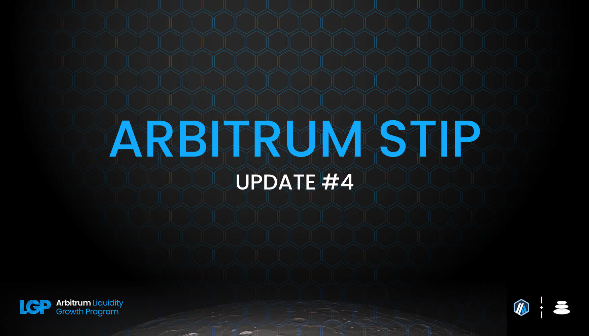
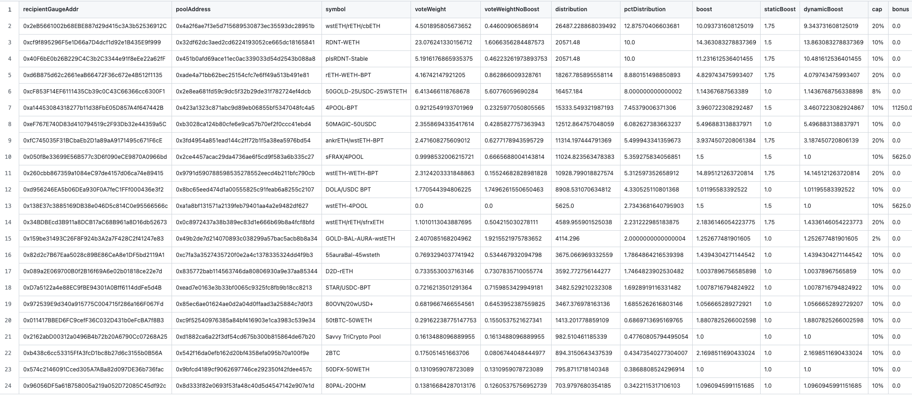
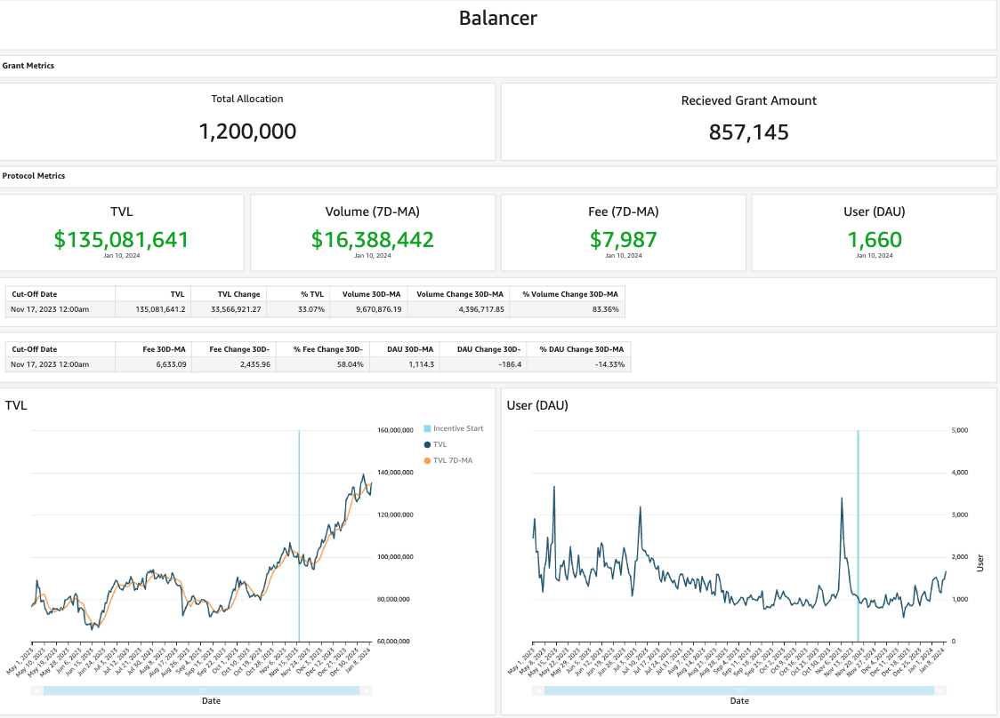
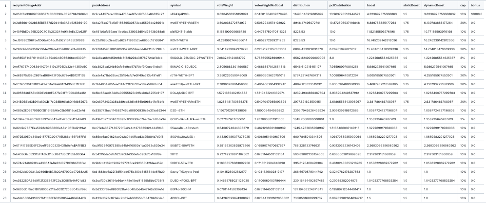

As per the STIP rules all protocols must post bi-weekly forum updates. The second updates will be due by this Friday, January 12th at 12:00PM EST

# Balancer Bi-Weekly Update 12-1-2024

## Recap of the Previous Two Weeks

**ARB Received Last Disbursement:** 342,858 (KYC delays resulted in collecting 2 biweekly payments at the start of the program, details in change section below)

**ARB Utilized as Incentives in the Last Two Weeks: [205,249](https://arbiscan.io/tx/0x47652a14eebd36fbcf03da6028c49a3a47f39becfa737efb09cec53f79b065eb)

**Contracts incentivized over the last 2 weeks:** A CSV of incentived along with details about $ARB flows to each one and how they were calculated can be found [here](https://github.com/BalancerMaxis/STIP_automation/blob/last-round-2023/output/dao_grant_2023-12-14_2023-12-28.csv).
These amounts of payment were queued and the required 171,429 $ARB sent for payment by this [multisig transaction](https://app.onchainden.com/safes/arb1:0xb6BfF54589f269E248f99D5956f1fDD5b014D50e/transactions/0x3fc881080230ed0608abfa36d82490fbcf9022d57f6247bacb83b48a21907c27) executed at 15:01 UTC on Friday Decemeber 29th.
These payments were be streamed to stakers in the gauge by the injector and the gauge system for 2 weeks, ending today on January 12th.

**Contract address label [Form](https://docs.google.com/forms/d/e/1FAIpQLSd2AYnjAaQjVOLtvemZpsWoN5sTJEJ8dLqdRDExTBQv_SUeug/viewform) completed for all addresses:** Yes

**ARB left over:** 68,571.6

**Plan for leftover ARB:** The leftover ARB was planned to be paid out over the following rounds as described in prior reports by distributing 205,714.8 for the remaining periods. However, because the short term incentive program distribution time will be extended, the amounts will be spread out evenly over the remaining periods. This will result in 82285.3 ARB being distributed per round until March 8. This final injection would then last until March 22 for ARB streamign to close out Balancer's STIP cycle. 

During the last distribution Balancer has been scaling up in liquidity in every facet of the dex. Primarily yield bearing assets such as ETH LSTs and stablecoins, as well as providing a hub for projects to deploy governance tokens with unique nuance for incentive programs will be outlined in detail in the summary section. The core purpose of Balancer's STIP strategy remains to grow the total amount of yield bearing assets on Arbitrum while enabling new value add projects an ease of access to join the ecosystem. 

Emphasizing the points above, the pools which provide the highest amounts of fees for Balancer are directed majority of BAL incentives, and therefore ARB, via our [core pool cycle](https://forum.balancer.fi/t/bip-457-core-pool-incentive-program-automation/5254). This will continue to propel stand out pools to scale up as incentives coincide with key metrics for both the Arbitrum foundation and Balancer. While incentives will decrease in total to spread out the ARB, the concentration will be directed towards the top performing pools. 

**Summary of incentives:** Incentives were dispersed based on the CSV above, which shows where the ARB was sent based upon the plan outlined in [Balancer's FINAL STIP Round 1 framework](https://forum.arbitrum.foundation/t/balancer-final-stip-round-1/16689). The dynamic boost of higher fee pools has taken more shape pushing incentives towards the higher performing pools in terms of fees earned. The efficiency of ARB incentive disitribution is becoming more efficient every round as the more profitable pools gain more traction over time.

On December 28th, the TVL of Balancer was 131M, volume, LST TVL, and fees were at all time highs and we once again have raised the bar. Both Aura and Beefy have made fast tracking liquidity providers into high growth positions for the protocol and ecosystem mcuh smoother. More and more large players are joining Arbitrum and they are choosing to do so on Balancer because of the way incenvites are directed towards the highest value add projects organically. 

The focus has been in every report the largest pools to track metrics of their growth, and which new one's emerge over time. [RDNT/WETH](https://app.balancer.fi/#/arbitrum/pool/0x32df62dc3aed2cd6224193052ce665dc181658410002000000000000000003bd) is still growing as the market rallies after a jump from 60MM to 74MM TVL last round it has increased again to 75MM. The last two rounds have average daily volumes 1.15, and 1.19MM this round has risen to 1.97MM daily volume. Looking at the same liquid staking derivative pools [cbETH/rETH/wstETH](https://app.balancer.fi/#/arbitrum/pool/0x4a2f6ae7f3e5d715689530873ec35593dc28951b000000000000000000000481), [WETH/rETH](https://app.balancer.fi/#/arbitrum/pool/0xade4a71bb62bec25154cfc7e6ff49a513b491e81000000000000000000000497), [wstETH/WETH](https://app.balancer.fi/#/arbitrum/pool/0x9791d590788598535278552eecd4b211bfc790cb000000000000000000000498) and [ankrETH/wstETH](https://app.balancer.fi/#/arbitrum/pool/0x3fd4954a851ead144c2ff72b1f5a38ea5976bd54000000000000000000000480) have reached all time highs once again. This is a combination of slightly growing total underlying ETH, and market upticking in dollar denominated value. The [sfrxETH/wstETH/rETH](https://app.balancer.fi/#/arbitrum/pool/0x0c8972437a38b389ec83d1e666b69b8a4fcf8bfd00000000000000000000049e) was new last round, and we highlighted TVL at 1MM being an achievement. In the previous epochs time the pool has hit 4.16MM TVL, a 4x in 2 weeks roughly. While the growth is incredible, we do expect it to continue slightly, and level out as the incentives meet fair market conditions. 

During the last two rounds had the ETH LST TVL climb from 37.15MM to 47.5MM and now Balancer holds just under 59MM TVL for this same set of assets at the time of writing (stable pools plus weighted portions). Volume has also increase from 38MM to 47.5MM. As we have been stating; the best pools for the ecosystem scale up due to the system and this is proof that these assets continue to get the support they need to result in net positive additions for the Arbitrum ecosystem. 

 Balancer has chosen to support several pools for routing by dedicating fixed ARB incentives on the 4POOL and the 4POOL/wstETH pair. The [4POOL](https://app.balancer.fi/#/arbitrum/pool/0x423a1323c871abc9d89eb06855bf5347048fc4a5000000000000000000000496) pool has seen a large jump in TVL going from 5.15MM to 9.39MM in the last two weeks. The core contributors at Balancer chose to reduce the swap fee to make the pool more competitive with the concentrated liqudity markets and this increase volume and fee flows vadtly. Volume of the last two rounds were 1.9 and 2.2MM per day; the pool sits at 6.8 MM in volume per day over the last two weeks. The [4POOL/wstETH](https://app.balancer.fi/#/arbitrum/pool/0xa1a8bf131571a2139feb79401aa4a2e9482df6270002000000000000000004b4) pool is down in TVL from 1.2MM to 870k and ultimatley the Balancer Maxis have decided the direct support of this pool should be removed as we plan to elongate the STIP ARB beyond the initial end date. The 4POOL while performing will have it's direct incentives migrated to the sFRAX/4POOL which offers LPs the yield bearing exposure of sFRAX while also acting as a way to incentivize diverse stablecoin routing. This is a more bang for Arbitrum's buck solution which we are happy to utilize. 

The previosu report highlighted two pools Balancer expected to be rising stars over this round. They were [sFRAX/4POOL](https://app.balancer.fi/#/arbitrum/pool/0x2ce4457acac29da4736ae6f5cd9f583a6b335c270000000000000000000004dc) and [sFRAX/wstETH](https://app.balancer.fi/#/arbitrum/pool/0xc757f12694f550d0985ad6e1019c4db4a803f1600002000000000000000004de). While the wstETH pairing has not yet been scaled up, the sFRAX/4POOL has just begun to fire on all cylinders. [Beefy](https://twitter.com/beefyfinance/status/1745579990601568656) and the FRAX teams have contributed to making this a peak performing pool which will capture every ounce of capital efficiency Balancer's unique architecture can offer to LPs. The pool has easily gone from sub 300k to 3MM TVL and undobutedly will increase in value, volume, and fees over the next epoch. This pool will be a repeat offender of the highlight list for next round. 

An honorable mention in the continuous growth of Balancer in the Arbitrum ecosystem is [Notional Finance](https://twitter.com/teddywoodward/status/1743657487117492437) who recently launched v3 on Arbitrum. Their leveraged vaults are gaining a large amount of traction and we are excited for the synergies from integration to result in inflows and opportunities for everyone in the Arbitrum ecosystem.

Stats from [Openblock Dashboard](https://www.openblocklabs.com/app/arbitrum/grantees/Balancer):

**Additional Info / Disclosures to Multisig:** 

- Tags for each contract address can be found in the csv above.
- See previous report for any comments on the current payment schematic of ARB to align with the deadline of the incentive cycle end proposed by the Arbitrum Foundation.
- Details can be seen on [this sheet](https://docs.google.com/spreadsheets/d/1k4i9ZNpxiRDC_bl4JtZMldV7J0LRQEVHZNqVpj8xG0g/edit#gid=0)

## STATS

**Link to Dashboard showing metrics:** [Balancer Arbitrum Liquidity Growth Program dashboard](https://dune.com/balancer/arbitrum-lgp?Start+date_d524c0=2023-12-15+00%3A00%3A00&End+date_d75e58=2023-12-28+00%3A00%3A00&End+date_daf146=&Start+date_d2264d=&Start+date_dc9002=2023-12-29+00%3A00%3A00&Start+date_dfbf60=2023-12-29+00%3A00%3A00&End+date_d85b75=2024-01-11+00%3A00%3A00&End+date_d19c82=2024-01-11+00%3A00%3A00)

**Average daily TVL:** $135,081,641

**Average daily transactions:** 711

**Average daily volumes:** $16,388,442

**Number of unique user addresses:** 3420

**Transaction fees:** Average daily: $15,051

## Plan For the Next Two Weeks

**Amount of ARB to be distributed:** 82285.3

**Contracts that will be incentivized:** Contracts to be incentivied are outlined in this [csv](https://github.com/BalancerMaxis/STIP_automation/blob/9c0791acfec184c114f840444bb1c4d183c9cbf4/output/dao_grant_2023-12-28_2024-01-11.csv), subject to change as more gauges are added to the veBAL system on Arbitrum.

**Contract address label [Form](https://docs.google.com/forms/d/e/1FAIpQLSd2AYnjAaQjVOLtvemZpsWoN5sTJEJ8dLqdRDExTBQv_SUeug/viewform) completed for all addresses:** Yes

**Mechanism for distribution incentives:** Distributions will be done every week via Balancer DAO's [ARB injector contract](https://arbiscan.io/address/0xF23d8342881eDECcED51EA694AC21C2B68440929#readContract) by sending direct incentives to the gauges of the respective pools in the Balancer ecosystem.

**Summary of incentives plan:** The incentives structure will continue to be carried out as planned since the original awarding of the STIP. As new pools join the ecosystem there will be competition between the most efficient ones on a fee per emission basis to determine where the majority of incentives are directed. More efficient pools receive more incentives and over time facilitate the optimal use of ARB for the liquidity hosted by Balancer on Arbitrum. As new strong contendors join the ecosystem the competition becomes more fierce between pools, ultimatley leading to more TVL, fees, and diversity on the platform.

The top performing pools will continue to receive the lion's share of incentives. Pools with yield bearing liquidity, such as [plsRDNT](https://app.balancer.fi/#/arbitrum/pool/0x451b0afd69ace11ec0ac339033d54d2543b088a80000000000000000000004d5) as a top yield earner will receive more emissions over time. The [sFRAX/4POOL](https://app.balancer.fi/#/arbitrum/pool/0x2ce4457acac29da4736ae6f5cd9f583a6b335c270000000000000000000004dc) as mentioned prior will grow rapidly as fixed incentives as well as outside incentives are pointed towards it from all the parties involved. Frax will also likely choose to scale up the [sFRAX/FRAX](https://app.balancer.fi/#/arbitrum/pool/0xdfa752ca3ff49d4b6dbe08e2d5a111f51773d3950000000000000000000004e8) pool which was recently deployed. 

**Summary of changes to the original plan:** Bi-weekly distributions will be scaled back as mentioned earlier in the report. The total value of ARB per round will be reduced from 205714.8 per round to 82285.3. This will make the program last through the first half of March. In the previous report the optimization BIP to strengthen top performing pool's allocations was put into affect, hence the ongoing improvement of efficiency over the previous and upcoming rounds. [BIP-522](https://forum.balancer.fi/t/bip-522-arbitrum-lgp-and-stip-adjustments/5473).

The fixed incentives which were initially directed at the 4POOL and wstETH/4POOL will now be pointed towards the sFRAX/4POOL and used to spread across the new timeline for distribution. The sFRAX/wstETH pool was planned to receive a portion of these, but due to the recent elongaiton of the program will no longer be done. 