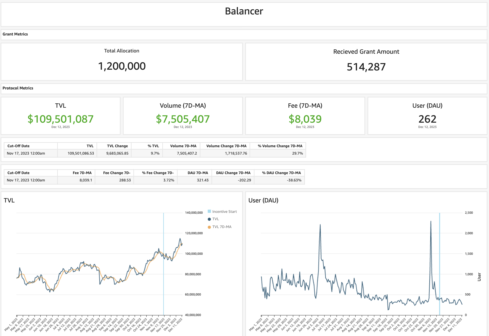

As per the STIP rules all protocols must post bi-weekly forum updates. The second updates will be due by this Friday, December 15st at 12:00PM EST

# Balancer Bi-Weekly Update 15-12-2023

## Recap of the Previous Two Weeks

**ARB Received Last Disbursement:** 342,858 (KYC delays resulted in collecting 2 biweekly payments at the start of the program, details in change section below)

**ARB Utilized as Incentives in the Last Two Weeks: [171,429](https://arbiscan.io/tx/0x6dbc5c291e96e228feb63a71571fa5432c4b3d887b2714ba845171229fa3cf82)

**Contracts incentivized over the last 2 weeks:** A CSV of incentived along with details about $ARB flows to each one and how they were calculated can be found [here](https://github.com/BalancerMaxis/data_automation/blob/main/notebooks/arb_dao_grant_distribution/output/dao_grant_2023-11-16_2023-11-30.csv).
These amounts of payment were queued and the required 171,429 $ARB sent for payment by this [multisig transaction](https://app.onchainden.com/safes/arb1:0xb6BfF54589f269E248f99D5956f1fDD5b014D50e/transactions/0x441c87976c91cdc38ec9c54aa06a0688b1b5c92b30b70d6c6bb927b8b6479130) executed at 16:02 UTC on Friday December 1st.
These payments will be streamed to stakers in the gauge by the injector and the gauge system for 2 weeks, ending today on December 29th.

**Contract address label [Form](https://docs.google.com/forms/d/e/1FAIpQLSd2AYnjAaQjVOLtvemZpsWoN5sTJEJ8dLqdRDExTBQv_SUeug/viewform) completed for all addresses:** Yes

**ARB left over:** 137,143.2

**Plan for leftover ARB:** In the last round the decision was made to increase biweekly amount distrbuted to 205,714.8 for the remaining periods. As we can see later in the report, growth is occurring over time on the network and project diversity is also blossoming on Balancer. This higher amount of incentives will be maintained for the remainder of the program, spreading out the leftover amount with new incoming amounts from the Hedgey streamer. 

Leaning into liquid staking derivatives, autocompounding assets such as plsRDNT, and yield bearing stable coins is the priority for Balancer collectively. By setting these pools in motion on the platform they will become self sustaining via the core pool cycle Balancer offers, and create sticky liquidity with underlying yield sources maximizing the value propostion of the projects who deploy on Balancer, the AMM itself, and Arbitrum as a whole. 

**Summary of incentives:** Incentives were dispersed based on the CSV above, which shows where the ARB was sent based upon the plan outlined in [Balancer's FINAL STIP Round 1 framework](https://forum.arbitrum.foundation/t/balancer-final-stip-round-1/16689). The current proposed method was not properly considering the boost for high fee earning pools due to a glitch in the automation Balancer DAO was using. Even with this, there has been an uptick in TVL and therefore fees on the platform. Last rounds data was skewed by not considering the yield fee Balancer takes, and therefore emission usage is much more efficient than previosuly displayed. 

Since December 1st key increases of TVL have been seen across various pools. As incentives are taking shape in the Aura layer of the ecosystem we see lasting depth on Balancer with LPs entering the "set and forget" mentality. Highlighting the same pools from last round gives an emphasis on the growth across the board. The [RDNT/WETH](https://app.balancer.fi/#/arbitrum/pool/0x32df62dc3aed2cd6224193052ce665dc181658410002000000000000000003bd) pool increased from 50MM to 60MM TVL and the average volume is up from 670k to 1.19 MM per day. Looking at the same liquid staking derivative pools from last round [cbETH/rETH/wstETH](https://app.balancer.fi/#/arbitrum/pool/0x4a2f6ae7f3e5d715689530873ec35593dc28951b000000000000000000000481), [WETH/rETH](https://app.balancer.fi/#/arbitrum/pool/0xade4a71bb62bec25154cfc7e6ff49a513b491e81000000000000000000000497), [wstETH/WETH](https://app.balancer.fi/#/arbitrum/pool/0x9791d590788598535278552eecd4b211bfc790cb000000000000000000000498) and [ankrETH/wstETH](https://app.balancer.fi/#/arbitrum/pool/0x3fd4954a851ead144c2ff72b1f5a38ea5976bd54000000000000000000000480) are near all time highs for TVL, with the exception of wstETH/wETH. New LST pools are outlined below to show where we expect the next wave of popularity to be spread, on top of these already strong pools.

Currently total ETH LST TVL is up to 37.15MM from 29.72MM (stable pools plus weighted portions) and volume for the two week period in the 4 mentioned stable LST pools is over 34.75MM from the previous rounds, 15.26MM. Due to Balancer's core pool incentive structure, as these LST pools increase in value their market share of rewards increases as well via self sustaining bribe mechanics. 

To come full cirlce on the primary liquidity on Balancer four routing supported by the ARB STIP are the, [4POOL](https://app.balancer.fi/#/arbitrum/pool/0x423a1323c871abc9d89eb06855bf5347048fc4a5000000000000000000000496) pool has has increased 5% at time of writing in TVL in the two week span and is averaging 2.2MM compared to previously 1.3MM in volume per day. Lastly the [4POOL/wstETH](https://app.balancer.fi/#/arbitrum/pool/0xa1a8bf131571a2139feb79401aa4a2e9482df6270002000000000000000004b4) pool peaked at 1.1MM in TVL over this period, but is currently at 820k TVL down from last rounds 920k. Volume however ticked upwards from 230k last round to over 500k by the second rounds end.

[Savy](https://forum.balancer.fi/t/bip-482-enable-savvy-tricrypto-svusd-sveth-svbtc-pool-gauge-arbitrum-with-2-emission-cap/5321/4), [ANKR](https://forum.balancer.fi/t/bip-493-enable-ankr-ankreth-gauge-arbitrum/5363/3) , and[Plutus](https://forum.balancer.fi/t/bip-497-enable-plsrdntv2-8020rdntweth-gauge-with-a-2-weight-cap/5377/3) were all mentioned last round as pools to keep an eye out for. The Savy and ANKR pools have yet to take part in the incentives cycle, and TVL respectively are at 128k and 18k. We will report further on these if they do begin to receive ARB.

The Plutus plsRDNT pool has begun to climb the charts though, as incentives from Radiant and Plutus have gone live via Aura. The pool will receive its first round of Balancer STIP incentives in the upcoming round. 

Stats from [Openblock Dashboard](https://www.openblocklabs.com/app/arbitrum/grantees/Balancer):

**Additional Info / Disclosures to Multisig:** 

- Tags for each contract address can be found in the csv above.
- As described in previous report, an extra 171,429 $ARB was collected on our first biweekly run that started November 17th, it was requested that all $ARB is paid out by February 15th.  As we were not expecting the second epoch of payments when prepairing payloads, we paid out the originally planned 171,429 $ARB, leaving 171,429 $ARB in the safe. This is how the amount of ARB per round increased.
  - Going forward, this 171,429 will be paid out evenly throughout the remaining rounds.  Details can be seen on [this sheet](https://docs.google.com/spreadsheets/d/1k4i9ZNpxiRDC_bl4JtZMldV7J0LRQEVHZNqVpj8xG0g/edit#gid=0)

## STATS

**Link to Dashboard showing metrics:** [Balancer Arbitrum Liquidity Growth Program dashboard](https://dune.com/balancer/arbitrum-lgp?Start+date_d2264d=&End+date_daf146=)

**COPY ALL THE STATS FROM THE DUNE DASH TO THE FORUM BELOW ON FRIDAY AND DELETE THIS NOTE**

**Average daily TVL:** $109,501,087

**Average daily transactions:** TBD

**Average daily volumes:** $7,505,407

**Number of unique user addresses:** TBD

**Transaction fees:** Average daily: $8,039

## Plan For the Next Two Weeks

**Amount of ARB to be distributed:** 205,714.8

**Contracts that will be incentivized:** Contracts to be incentivied are outlined in this [csv](https://github.com/BalancerMaxis/data_automation/blob/main/notebooks/arb_dao_grant_distribution/output/dao_grant_2023-11-16_2023-11-30.csv), subject to change as more gauges are added to the veBAL system on Arbitrum. -NEEDS UPDATE-

- NEW ROUND CSV IMAGE OR TABLE NEEDED - 

**Contract address label [Form](https://docs.google.com/forms/d/e/1FAIpQLSd2AYnjAaQjVOLtvemZpsWoN5sTJEJ8dLqdRDExTBQv_SUeug/viewform) completed for all addresses:** Yes

**Mechanism for distribution incentives:** Distributions will be done every week via Balancer DAO's [ARB injector contract](https://arbiscan.io/address/0xF23d8342881eDECcED51EA694AC21C2B68440929#readContract) by sending direct incentives to the gauges of the respective pools in the Balancer ecosystem.

**Summary of incentives plan:** Incentives will be heading to the pools mentioned above over the next two week period. The pools Balancer expects to be highlights of the next report are the ones mentioned above, and these new pools joining the Arbitrum ecosystem. The [plsRDNT](https://app.balancer.fi/#/arbitrum/pool/0x451b0afd69ace11ec0ac339033d54d2543b088a80000000000000000000004d5) pool which will be kickstarted increasing in magnitude over time as it scales up. This will have second order affects permanently locking RDNT/WETH tokens on the platform. The new LST pool to bring more yield bearing liquidity to the ecosystem is the [sfrxETH tripool](https://app.balancer.fi/#/arbitrum/pool/0x0c8972437a38b389ec83d1e666b69b8a4fcf8bfd00000000000000000000049e). While TVL is negligent currently, Balancer has placed a bribe to get incentives started and begin bootstrapping another LST juggernaught.   

**Summary of changes to the original plan:** As stated above, biweekly distributions were increased from 171429 to 205714.2 $ARB in order to pay out the full amount before February 15th as requested. Aside from the increase in incentive density, the plan will be carried out as planned, with additional gauges as they approved by Balancer governance. 