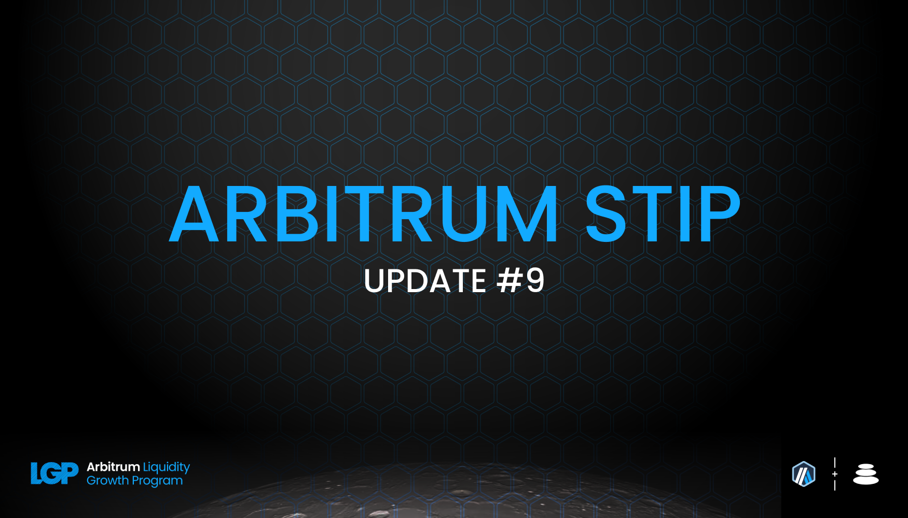
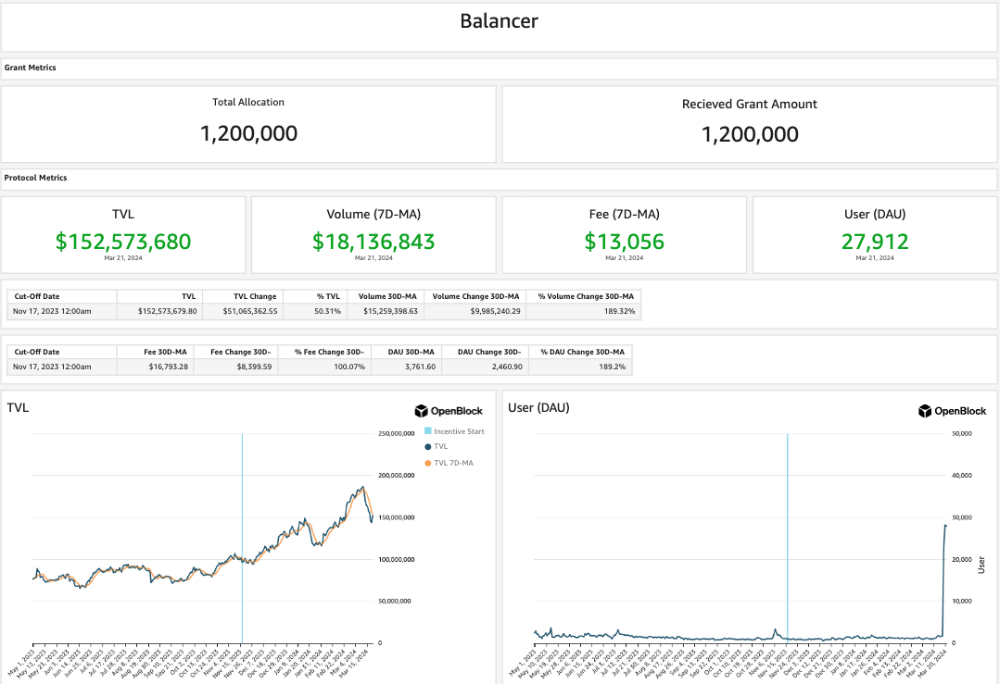
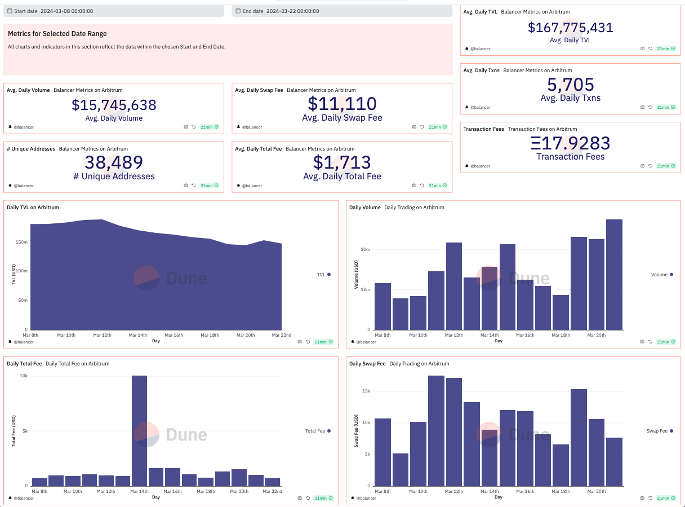

As per the STIP rules all protocols must post bi-weekly forum updates. The second updates will be due by this Friday, March 22nd at 12:00PM EST

# Balancer Bi-Weekly Update 22-3-2024

## Recap of the Previous Two Weeks

**ARB Received Last Disbursement:** 0 (KYC delays resulted in collecting 2 biweekly payments at the start of the program, details in change section below)

**ARB Utilized as Incentives in the Last Two Weeks: [82,285.3](https://arbiscan.io/tx/0x0e00d20b8566ea1552b4dfaf24f5811131c3e3df9e49dcc4756b04bc39dcc36f)

**Contracts incentivized over the last 2 weeks:** A CSV of incentived along with details about $ARB flows to each one and how they were calculated can be found [here](https://github.com/BalancerMaxis/multisig-ops/pull/813/files#diff-4e4862b4eeedd46dd2a70206c43e27a92bcc47f51e274de8572197ec828e9e5b).
These amounts of payment were queued and the required 82,285.3 $ARB sent for payment by this [multisig transaction](https://app.onchainden.com/safes/arb1:0xb6BfF54589f269E248f99D5956f1fDD5b014D50e/transactions/0x8249426f463e81e388e85a88ab014a8a8ff70e20ba3da6510bbbd980218cc100) executed at 16:10 UTC on Friday March 8th.
These payments were be streamed to stakers in the gauge by the injector and the gauge system for 2 weeks, ending today on March 8th.

**Contract address label [Form](https://docs.google.com/forms/d/e/1FAIpQLSd2AYnjAaQjVOLtvemZpsWoN5sTJEJ8dLqdRDExTBQv_SUeug/viewform) completed for all addresses:** Yes

**ARB left over:** 0

**Plan for leftover ARB:** The STIP has concluded and there is no left over ARB for Balancer to allocate to users. The time has been exciting for all parties involved. We do look forward to future opportunities to work with the Arbitrum Foundation and community to grow healthy, sustainable liquidity for the network. Thank you to the community and everyone involved from all sides. 

**Summary of incentives:** Incentives were sent to each pool's respective gauge based on [Balancer's FINAL STIP Round 1 framework](https://forum.arbitrum.foundation/t/balancer-final-stip-round-1/16689). Anyone who has been paying attention to what Balancer has done with the STIP over the passed quarter already knows the core pool and incentive optimization algorithm we have developed in order to entice liquidity providers to deepen the liquidity in the pool's that matter on a dex and network. Given the end result of the STIP leaving Balancer with a near 2x in TVL, a substantial increase in daily average users and transaction volume throughput several degrees higher than it was prior, this was a huge success. 

Balancer has ended on a high note with the highest average TVL for an epoch just under 168MM TVL on the dex with roughly a 10% utilization for swap volume across all pools. High volume pairs such as liquid staking derivatives, ve8020 pools, and stable coin pairs lead this charge and only on Balancer are user's also able to not worry about their yield being arbitraged away by diverging asset prices in the interest bearing asset classes.

For the last time, we will highlight the pools which have carried the torch for Balancer and the pairs which Arbitrum should be most excited about incentivizing the depth of on chain.[RDNT/WETH](https://app.balancer.fi/#/arbitrum/pool/0x32df62dc3aed2cd6224193052ce665dc181658410002000000000000000003bd) after coming off all time highs of over 100MM this epoch has cooled off and sits at a modest 67.5MM TVL for the time being, having driven 1.4MM in volume per day for the last two weeks.

Balancer, home of the liquid staking derivative continues to be a trail blazer in the space by bring more LRTs to Arbitrum even as the STIP comes to a close. The heavy hitters [cbETH/rETH/wstETH](https://app.balancer.fi/#/arbitrum/pool/0x4a2f6ae7f3e5d715689530873ec35593dc28951b000000000000000000000481), [WETH/rETH](https://app.balancer.fi/#/arbitrum/pool/0xade4a71bb62bec25154cfc7e6ff49a513b491e81000000000000000000000497), and [sfrxETH/wstETH/rETH](https://app.balancer.fi/#/arbitrum/pool/0x0c8972437a38b389ec83d1e666b69b8a4fcf8bfd00000000000000000000049e) have all dropped in TVL as planned to 3.4MM, 3.3MM, and 0.9MM TVL respectively. They're migrations are to be moved to the following pools:
[rETH/wETH](https://app.balancer.fi/#/arbitrum/pool/0xd0ec47c54ca5e20aaae4616c25c825c7f48d40690000000000000000000004ef) which now has 7.15MM TVL.
[wstETH/sfrxETH](https://app.balancer.fi/#/arbitrum/pool/0xc2598280bfea1fe18dfcabd21c7165c40c6859d30000000000000000000004f3) at 2.9MM. 
[cbETH/wstETH/rETH](https://app.balancer.fi/#/arbitrum/pool/0x2d6ced12420a9af5a83765a8c48be2afcd1a8feb000000000000000000000500) and 5.25MM.
This in total is an improvement in TVL when adding up the fragment portions compared to the last round. 
[wstETH/WETH](https://app.balancer.fi/#/arbitrum/pool/0x9791d590788598535278552eecd4b211bfc790cb000000000000000000000498) has seen a minor drawback in TVL still sitting at 13MM and [ankrETH/wstETH](https://app.balancer.fi/#/arbitrum/pool/0x3fd4954a851ead144c2ff72b1f5a38ea5976bd54000000000000000000000480) has upticked to 7.2MM for the time being. 

ETH LST TVL was 57MM in USD terms last round, and due to the market taking a large downward move Balancer's LST TVL sits now at 44MM (stable pools plus weighted portions). This is however a net neutral move in ETH terms, proving the stickiness of Balancer's flywheel to be quite competitive based on the TVL for these pools at the start of the year. 

Balancer Maxis continue to incentivize the 4POOL for core stablecoin routing using their vlAura holdings. The [4POOL](https://app.balancer.fi/#/arbitrum/pool/0x423a1323c871abc9d89eb06855bf5347048fc4a5000000000000000000000496) pool has been winning volume across the abitrum network proving the competitive nature of the dynamic and low swap fee environment Balancer offers. The pool sits at 4.5MM TVL and has proccessed around 120MM in volume in the last two weeks. 43MM in volume today alone. 

The [sFRAX/4POOL](https://app.balancer.fi/#/arbitrum/pool/0x2ce4457acac29da4736ae6f5cd9f583a6b335c270000000000000000000004dc) pool was at  3.3MM TVL due to market rates across Defi for stablecoins being quite high in lending markets, but as those values retract the liquidity position becomes more attractive. This is great haven for liquidity providers to earn passive yield organically while trades can route through the 4POOL. TVL has increased to 4.3MM over the last two weeks.

Stats from [Openblock Dashboard](https://www.openblocklabs.com/app/arbitrum/grantees/Balancer) displaying the entirety of the grant performance:

**Additional Info / Disclosures to Multisig:** 

- Tags for each contract address can be found in the csv above.
- See previous report for any comments on the current payment schematic of ARB to align with the deadline of the incentive cycle end proposed by the Arbitrum Foundation.
- Details can be seen on [this sheet](https://docs.google.com/spreadsheets/d/1k4i9ZNpxiRDC_bl4JtZMldV7J0LRQEVHZNqVpj8xG0g/edit#gid=0)

## STATS

**Link to Dashboard showing metrics:** [Balancer Arbitrum Liquidity Growth Program dashboard](https://dune.com/balancer/arbitrum-lgp?End+date_daf146=&End+date_d75e58=2023-12-28+00%3A00%3A00&Start+date_d2264d=&End+date_d85b75=2024-02-08+00%3A00%3A00&End+date_d19c82=2024-02-08+00%3A00%3A00&Start+date_dc9002=2024-01-26+00%3A00%3A00&Start+date_dfbf60=2024-01-26+00%3A00%3A00&End+date_d9e9d1=2024-03-22+00%3A00%3A00&Start+date_d524c0=2024-03-08+00%3A00%3A00)

**Average daily TVL:** $167,775,431

**Average daily transactions:** 5,705

**Average daily volumes:** $15,745,638

**Number of unique user addresses:** 38,489

**Transaction fees:** Average daily: $12,823

## Plan For the Next Two Weeks

**Amount of ARB to be distributed:** 0

**Contracts that will be incentivized:** 

**Contract address label [Form](https://docs.google.com/forms/d/e/1FAIpQLSd2AYnjAaQjVOLtvemZpsWoN5sTJEJ8dLqdRDExTBQv_SUeug/viewform) completed for all addresses:** Yes

**Mechanism for distribution incentives:** Distributions were done every week via Balancer DAO's [ARB injector contract](https://arbiscan.io/address/0xF23d8342881eDECcED51EA694AC21C2B68440929#readContract) by sending direct incentives to the gauges of the respective pools in the Balancer ecosystem.

**Summary of incentives plan:** Balancer's community has expanded and the existing base has thoroughly enjoyed building long lasting solutions on Arbitrum to create long lasting impacts in the ecosystem. Leveraging various tech stacks and layers on top of Balancer has led to cross pollination on Arbitrum that has not taken place on any other network. Balancer looks forward to a fruitful relationship with the Arbitrum ecosysetm and Foundation in the future. 

**Summary of changes to the original plan:** 