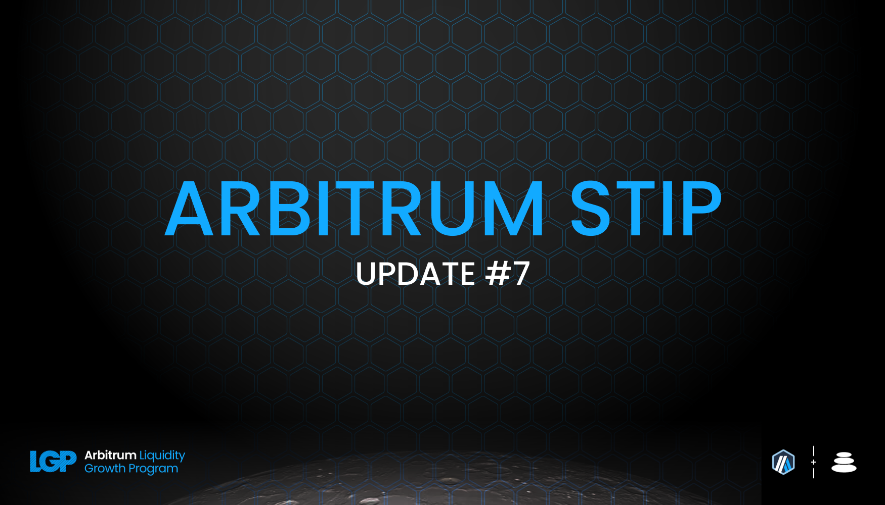
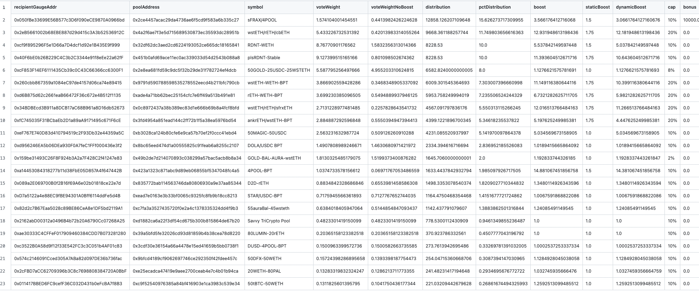
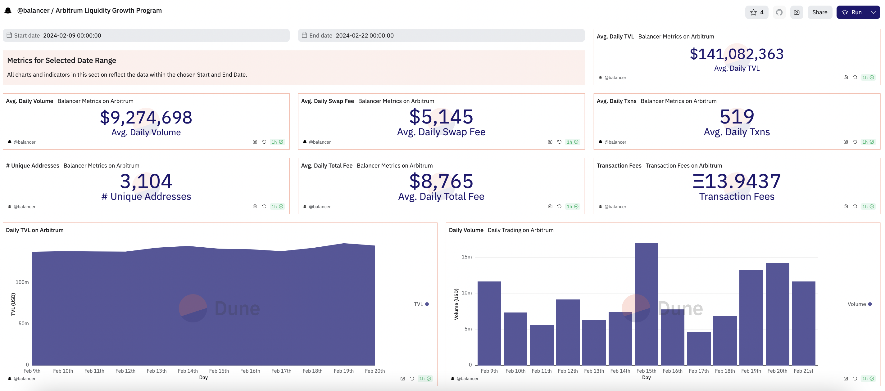

As per the STIP rules all protocols must post bi-weekly forum updates. The second updates will be due by this Friday, February 9th at 12:00PM EST

# Balancer Bi-Weekly Update 23-2-2024

## Recap of the Previous Two Weeks

**ARB Received Last Disbursement:** 0 (KYC delays resulted in collecting 2 biweekly payments at the start of the program, details in change section below)

**ARB Utilized as Incentives in the Last Two Weeks: [82,285.3](https://arbiscan.io/tx/0xb29c09368d7e7a34fc31b5b92382e5c84b3cf8fd2342ef3405911bef2ed74773)

**Contracts incentivized over the last 2 weeks:** A CSV of incentived along with details about $ARB flows to each one and how they were calculated can be found [here](https://github.com/BalancerMaxis/multisig-ops/blob/main/MaxiOps/STIP/dao_grant_2024-01-25_2024-02-08.csv).
These amounts of payment were queued and the required 82,285.3 $ARB sent for payment by this [multisig transaction](https://app.onchainden.com/safes/arb1:0xb6BfF54589f269E248f99D5956f1fDD5b014D50e/transactions/0x8376c9e8346c39b11cd5385638fca2148b7f9822f709f4e57e226f56d642d583) executed at 15:33 UTC on Friday February 9th.
These payments were be streamed to stakers in the gauge by the injector and the gauge system for 2 weeks, ending today on February 9th.

**Contract address label [Form](https://docs.google.com/forms/d/e/1FAIpQLSd2AYnjAaQjVOLtvemZpsWoN5sTJEJ8dLqdRDExTBQv_SUeug/viewform) completed for all addresses:** Yes

**ARB left over:** 164,570.7

**Plan for leftover ARB:** The leftover ARB will be distributed out until through the month of March. The Balancer DAO is distributing 82285.3 ARB per round until March 8. This final injection would then last until March 22 for ARB streamign to close out Balancer's STIP cycle. 

This injection is the second to last of ARB incentives and third since Balancer has scaled back incentives. With the market sentiment trending positive overall, Balancer' Arbitrum performance has trended upwards with it. With overall stats improving even with the decreased incentives we will continue to ride out the STIP as we previously designated through the end of March.

Please be aware the via [BIP-547](https://forum.balancer.fi/t/bip-547-migrate-reth-gauges-arbitrum/5572/2) migrations for 3 gauges will occur meaning incentives will be redirected to them over time in particular for pools which previously included Rocketpools' rETH token.

**Summary of incentives:** Incentives were injected to pool gauge's based on the CSV above, which shows where the ARB was sent based upon the plan outlined in [Balancer's FINAL STIP Round 1 framework](https://forum.arbitrum.foundation/t/balancer-final-stip-round-1/16689). Arbitrum's incentives have been and continue to flow to pool's on Balancer in the most efficient way possible. The top BAL receivers are the top earners in majority of cases, and fee revenue amiplifies the allocation of BAL and ARB that value add pools receive in the Balancer ecosystem. The core pool flywheel is carrying on it's intended nature and will continue to do so even after the STIP. 

In the previous two reports the average daily TVL has been 119M steadily and current 141M is on Balancer, nearly back to the previous ATH during prior epochs. The value in ETH has remained generally stagnant with primarily new partners and integrations bringing in new TVL. This does reinforce the ongoing narrative of Balancer acting as base layer for yield optimizing protocols on Arbitrum. This happens at both the pool and vault levels built on top of our Dex. Even with a 60% reduction in incentives TVL in USD terms is near all time high due to market conditions combined with the stickiness Balancer has fostered.

To remain consistent here are the statistics of Balancer's top performing pools in comparison to the previous epoch. [RDNT/WETH](https://app.balancer.fi/#/arbitrum/pool/0x32df62dc3aed2cd6224193052ce665dc181658410002000000000000000003bd) has hit an all time high from the entirety of the  STIP. Last weeks 68MM has been drawfed by the current 82MM TVL. Radiant continues to prove the 80/20 modelh has fortifying implications similar to how it has benefitted Balancer's veBAL. The last round had average daily volume of 0.25MM per day and has since recovered from this dip to 0.7MM most recently 2.3M in volume yesterday. Looking at the same liquid staking derivative pools [cbETH/rETH/wstETH](https://app.balancer.fi/#/arbitrum/pool/0x4a2f6ae7f3e5d715689530873ec35593dc28951b000000000000000000000481), [WETH/rETH](https://app.balancer.fi/#/arbitrum/pool/0xade4a71bb62bec25154cfc7e6ff49a513b491e81000000000000000000000497), have both stay roughly stagnant in TVL terms, seem slight downticks in total ETH. [wstETH/WETH](https://app.balancer.fi/#/arbitrum/pool/0x9791d590788598535278552eecd4b211bfc790cb000000000000000000000498) and [ankrETH/wstETH](https://app.balancer.fi/#/arbitrum/pool/0x3fd4954a851ead144c2ff72b1f5a38ea5976bd54000000000000000000000480) have both hit all time highs in USD terms but relatively constant in ETH terms. [sfrxETH/wstETH/rETH](https://app.balancer.fi/#/arbitrum/pool/0x0c8972437a38b389ec83d1e666b69b8a4fcf8bfd00000000000000000000049e) jumped quickly up to 5.65MM in just four weeks and is now sitting at 5.48MM with its highest ETH holdings to date.

ETH LST TVL was 50MM in USD terms last round, not 60MM as mentioned, and overall has stayed the same into this epoch. (stable pools plus weighted portions. Volume for these pools has been consistnelty between 35-38MM per epoch for the last rounds and this round has been 53.7MM in volume led primarily by the wstETH/wETH pool with 35.6MM volume on it's own. Given the circumstances this exemplifies the strength of Balancer's infrastructure and strategy resulting in beneficial aligned outcomes for Arbitrum. 

Last round the ARB incentives were cut from the 4POOL howver the Balancer Maxis continue to incentivize it using their vlAura holdings. The [4POOL](https://app.balancer.fi/#/arbitrum/pool/0x423a1323c871abc9d89eb06855bf5347048fc4a5000000000000000000000496) pool has increased from 6.28MM to 3.6 MM TVL and still sees significant volume, consistent with the value of over 4MM per day from the previous epoch. 

The [sFRAX/4POOL](https://app.balancer.fi/#/arbitrum/pool/0x2ce4457acac29da4736ae6f5cd9f583a6b335c270000000000000000000004dc) pool has dropped from 6.1MM to 3.3MM TVL likely due to market conditions defi users are deploying stable capital back into markets making the barrier for entry on stable coin yield higher than it was previously. The sFRAX/4POOL remains a competitive place for LPs to confidentatly supply liquidity and receive modest incentives. Regardless, the volume in the 4POOL has not seen a significant drop so intended efficieny has not been sacrificed substantially. 

Stats from [Openblock Dashboard](https://www.openblocklabs.com/app/arbitrum/grantees/Balancer):

**Additional Info / Disclosures to Multisig:** 

- Tags for each contract address can be found in the csv above.
- See previous report for any comments on the current payment schematic of ARB to align with the deadline of the incentive cycle end proposed by the Arbitrum Foundation.
- Details can be seen on [this sheet](https://docs.google.com/spreadsheets/d/1k4i9ZNpxiRDC_bl4JtZMldV7J0LRQEVHZNqVpj8xG0g/edit#gid=0)

## STATS

**Link to Dashboard showing metrics:** [Balancer Arbitrum Liquidity Growth Program dashboard](https://dune.com/balancer/arbitrum-lgp?End+date_daf146=&End+date_d75e58=2023-12-28+00%3A00%3A00&Start+date_d2264d=&End+date_d85b75=2024-02-08+00%3A00%3A00&End+date_d19c82=2024-02-08+00%3A00%3A00&Start+date_dc9002=2024-01-26+00%3A00%3A00&Start+date_dfbf60=2024-01-26+00%3A00%3A00&Start+date_d524c0=2024-02-09+00%3A00%3A00&End+date_d9e9d1=2024-02-22+00%3A00%3A00)

**Average daily TVL:** $141,082,363

**Average daily transactions:** 519

**Average daily volumes:** $9,274,698

**Number of unique user addresses:** 3104

**Transaction fees:** Average daily: $8,765

## Plan For the Next Two Weeks

**Amount of ARB to be distributed:** 82285.3

**Contracts that will be incentivized:** Contracts to be incentivied are outlined in this [csv](https://github.com/BalancerMaxis/multisig-ops/pull/813/files#diff-4e4862b4eeedd46dd2a70206c43e27a92bcc47f51e274de8572197ec828e9e5b), subject to change as more gauges are added to the veBAL system on Arbitrum.

**Contract address label [Form](https://docs.google.com/forms/d/e/1FAIpQLSd2AYnjAaQjVOLtvemZpsWoN5sTJEJ8dLqdRDExTBQv_SUeug/viewform) completed for all addresses:** Yes

**Mechanism for distribution incentives:** Distributions will be done every week via Balancer DAO's [ARB injector contract](https://arbiscan.io/address/0xF23d8342881eDECcED51EA694AC21C2B68440929#readContract) by sending direct incentives to the gauges of the respective pools in the Balancer ecosystem.

**Summary of incentives plan:** Balancer's data based core pool process optimizes the incentives throughout the ecosystem and has been continuosuly improved for the Arbitrum STIP. Amplifying high revenue generating pool's share of the ARB Balancer was generously given has been streamlined to create an upward spiraling liquidity trend. 

The program will eventually end, concluding in March and Balancer will maintain a large amount of the liquidity it has built up from the STIP. Yield bearing tokens will continue to be incentivized by their own revenue generation and the layers built on top of Balancer will leverage various underlying yield sources to make LPing on the platform as competitive as possible in the Arbitrum ecosystem.

The tldr from the rETH migration boils down to a minor issue in the rate providing contract used for rETH to be pegged in stable pools was remedied in a new deployment. This new deployments requires all rETH pools to utilize a new pool hence the migration. Core pool incentives will be directed from the old pools to the new ones to incentivize users to move into the non-problematic pools. This is done by updating the Core Pools Rerouting Configuration:

The currently empty core_pools_routing.json 1 will be changed to read as follows to reroute core pool incentives from the old rocket pools to the new one.

**Summary of changes to the original plan:** Bi-weekly distributions will be 82285.3 per round due to the extension plan in place from the Arbitrum Foundation. This will make the program last through the first half of March. The optimization BIP details to strengthen top performing pool's can be seen here [BIP-522](https://forum.balancer.fi/t/bip-522-arbitrum-lgp-and-stip-adjustments/5473).