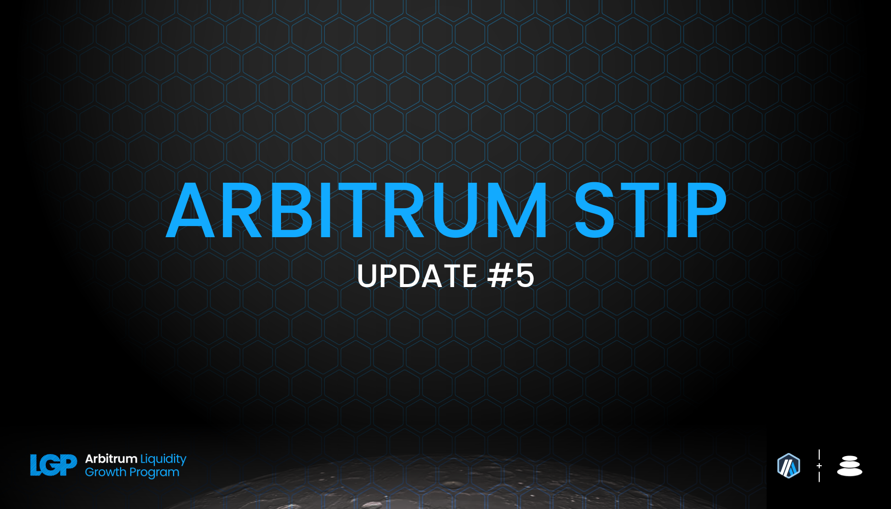

As per the STIP rules all protocols must post bi-weekly forum updates. The second updates will be due by this Friday, January 26th at 12:00PM EST

# Balancer Bi-Weekly Update 26-1-2024

## Recap of the Previous Two Weeks

**ARB Received Last Disbursement:** 171,429 (KYC delays resulted in collecting 2 biweekly payments at the start of the program, details in change section below)

**ARB Utilized as Incentives in the Last Two Weeks: [82,285.3](https://arbiscan.io/tx/0x375301a47e9796c8be254b3afb073ad3a5414f355867971de37b86f8ba37f0c1)

**Contracts incentivized over the last 2 weeks:** A CSV of incentived along with details about $ARB flows to each one and how they were calculated can be found [here](https://github.com/BalancerMaxis/STIP_automation/blob/9c0791acfec184c114f840444bb1c4d183c9cbf4/output/dao_grant_2023-12-28_2024-01-11.csv).
These amounts of payment were queued and the required 82,285.3 $ARB sent for payment by this [multisig transaction](https://app.onchainden.com/safes/arb1:0xb6BfF54589f269E248f99D5956f1fDD5b014D50e/transactions/0x068bd0f58720eb6a57167df5ce7f8e0a4a9cc16bccd25df2fea13fd75c207322) executed at 15:57 UTC on Friday January 12th.
These payments were be streamed to stakers in the gauge by the injector and the gauge system for 2 weeks, ending today on January 26th.

**Contract address label [Form](https://docs.google.com/forms/d/e/1FAIpQLSd2AYnjAaQjVOLtvemZpsWoN5sTJEJ8dLqdRDExTBQv_SUeug/viewform) completed for all addresses:** Yes

**ARB left over:** 157715.3

**Plan for leftover ARB:** The leftover ARB will be distributed out until through the month of March as requested by the Arbitrum Foundation. The result for Balancer is 82285.3 ARB being distributed per round until March 8. This final injection would then last until March 22 for ARB streamign to close out Balancer's STIP cycle. 

This was the first distribution round where Balancer has scaled back incentives by over 50%. This reduction is a test to validate that the liquidity built up on Balancer is indeed sticky and not a short term benefit to the Arbitrum ecosystem. Thep prior rounds had 205714.8 ARB per epoch, in comparison to the 82,285.3 distributed over the last two weeks. Based on the downward market conditions in the last several days the mark has been humbling, but refreshing for the protocol to see the best pools maintaining their incentive optimized footholds thanks to Balancer's core pool mechanics, emphasized by the STIP. 

**Summary of incentives:** Incentives were injected to pool gauge's based on the CSV above, which shows where the ARB was sent based upon the plan outlined in [Balancer's FINAL STIP Round 1 framework](https://forum.arbitrum.foundation/t/balancer-final-stip-round-1/16689). Balancer's core pool mechanics cycles high volume and high yield bearing liquidity fees back into the incentives markets giving strong performers the ability to self sustain on Balancer. Combined with the STIP incentive program proposed by Balancer DAO and funded by the Arbitrum Foundation, the ARB incentives have been consistently directed towards these pools in a spiral up trajectory to maximize their efficiency. 

On Janaury 11th, the TVL of Balancer was 135M, volume, LST TVL, and fees were at all time highs. Currently we are reporting our first round with a reduction in core metrics and ultimatley the efficiency has not decreased for Balancer. The average daily TVL has still been strong at 137MM, however at the time of writing has dropped to 119MM. The integrations and layers on top of Balancer are continuing to expand and as mentioned in the previous report related to Aura, Plutus, Beefy, and Notional Finance. The initial heavy push of ARB incentives has increased Balancer's already strong presence on Arbitrum for certain, but true value is in seeing a high retention of metrics with a 60% reduction in ARB dispersed per round. 

Balancer's largest pools metrics continue to carry the protocol forward, and several new comers have firmed up their position in the ecosystem. To put in perspective the reductions in TVL in some of these pools, the market is down roughly 15% in USD terms. [RDNT/WETH](https://app.balancer.fi/#/arbitrum/pool/0x32df62dc3aed2cd6224193052ce665dc181658410002000000000000000003bd) has seen a pullback from its recent peak at 75MM down to 64MM. The last two rounds have average daily volumes 1.19MM and 1.97MM daily volume, currently the pool is still performing well at 1.18MM. Looking at the same liquid staking derivative pools [cbETH/rETH/wstETH](https://app.balancer.fi/#/arbitrum/pool/0x4a2f6ae7f3e5d715689530873ec35593dc28951b000000000000000000000481), [WETH/rETH](https://app.balancer.fi/#/arbitrum/pool/0xade4a71bb62bec25154cfc7e6ff49a513b491e81000000000000000000000497), [wstETH/WETH](https://app.balancer.fi/#/arbitrum/pool/0x9791d590788598535278552eecd4b211bfc790cb000000000000000000000498) and [ankrETH/wstETH](https://app.balancer.fi/#/arbitrum/pool/0x3fd4954a851ead144c2ff72b1f5a38ea5976bd54000000000000000000000480) have for the first time in the STIP's history have not all reached all time highs. However with the market turning down The [cbETH/rETH/wstETH](https://app.balancer.fi/#/arbitrum/pool/0x4a2f6ae7f3e5d715689530873ec35593dc28951b000000000000000000000481) has jumped massively in TVL while the rest have stayed relatively flat in TVL or dropped with the market dynamics. Overall the total ETH in Balancer pools has continuously increased. [sfrxETH/wstETH/rETH](https://app.balancer.fi/#/arbitrum/pool/0x0c8972437a38b389ec83d1e666b69b8a4fcf8bfd00000000000000000000049e) has been our new and fastest grower, but going forward will be joining the group as a standard LST pool to follow the metrcis of. In the previous epochs the pool has hit 4.16MM TVL, and despite the drop in ETH price and reduction in incentives has still pushed to 5.48MM TVL. 

ETH LST TVL has been climbing dramatically on Balancer and Arbitrum throughout the STIP's duration from 47.5MM to 59MM last round and now Balancer holds just under 52MM TVL for this same set of assets at the time of writing (stable pools plus weighted portions). This is a net increase in ETH from the previous round, but reflects poorly due to the difference in USD price between snapshots. Volume has across these pools was at an all time high of 47.5MM for the period, but has decayed to the round prior's level matching it at 38MM. Given the circumstances this exemplifies the strength of Balancer's infrastructure and strategy resulting in beneficial aligned outcomes for Arbitrum. 

Last round the ARB incentives were cut from the 4POOL and the 4POOL/wstETH pair. The [4POOL](https://app.balancer.fi/#/arbitrum/pool/0x423a1323c871abc9d89eb06855bf5347048fc4a5000000000000000000000496) pool has maintained 5.47MM TVL without any direct incentivization and still sees significant volume, averaging 5.16MM per day this round. Liquidity will remain sticky for this pool because of it being nested in the sFRAX/4POOL, where incentives migrated to  offers LPs the yield bearing exposure of sFRAX while also acting as a way to incentivize diverse stablecoin routing. As described in the previous report, this is is more efficiency for Balancer liquidity providers and the Arbitrum Foundation's STIP funding.

To close the loop on the pools to watch mentioned in the report 4, they [sFRAX/4POOL](https://app.balancer.fi/#/arbitrum/pool/0x2ce4457acac29da4736ae6f5cd9f583a6b335c270000000000000000000004dc) pool has maintained 5MM TVL and while it is relatively low volume compared to the pools above, it is the most efficient way for the yield of sFRAX to subsisize stable coin support on Balancer and Arbitrum making the cost of sticky liqudity lower for both parties. Liqudity providers also are rewarded with the additional organic yield, making it a win for all. Beefy continues to leverage all integrations of Aura, sFRAX, and the STIP to make liquidity providers increase their positions over time via their autocompounding vaults and this plays a strong role in all LST pools also outperforming the market this round. 

Stats from [Openblock Dashboard](https://www.openblocklabs.com/app/arbitrum/grantees/Balancer):

**Additional Info / Disclosures to Multisig:** 

- Tags for each contract address can be found in the csv above.
- See previous report for any comments on the current payment schematic of ARB to align with the deadline of the incentive cycle end proposed by the Arbitrum Foundation.
- Details can be seen on [this sheet](https://docs.google.com/spreadsheets/d/1k4i9ZNpxiRDC_bl4JtZMldV7J0LRQEVHZNqVpj8xG0g/edit#gid=0)

## STATS

**Link to Dashboard showing metrics:** [Balancer Arbitrum Liquidity Growth Program dashboard](https://dune.com/balancer/arbitrum-lgp?Start+date_d524c0=2023-12-15+00%3A00%3A00&End+date_daf146=&End+date_d75e58=2023-12-28+00%3A00%3A00&Start+date_d2264d=&End+date_d85b75=2024-01-25+00%3A00%3A00&End+date_d19c82=2024-01-25+00%3A00%3A00&Start+date_dc9002=2024-01-12+00%3A00%3A00&Start+date_dfbf60=2024-01-12+00%3A00%3A00)

**Average daily TVL:** $137,263,052

**Average daily transactions:** 660

**Average daily volumes:** $11,319,140

**Number of unique user addresses:** 4037

**Transaction fees:** Average daily: $10,913

## Plan For the Next Two Weeks

**Amount of ARB to be distributed:** 82285.3

**Contracts that will be incentivized:** Contracts to be incentivied are outlined in this [csv](https://github.com/BalancerMaxis/STIP_automation/blob/9c0791acfec184c114f840444bb1c4d183c9cbf4/output/dao_grant_2023-12-28_2024-01-11.csv), subject to change as more gauges are added to the veBAL system on Arbitrum.

**Contract address label [Form](https://docs.google.com/forms/d/e/1FAIpQLSd2AYnjAaQjVOLtvemZpsWoN5sTJEJ8dLqdRDExTBQv_SUeug/viewform) completed for all addresses:** Yes

**Mechanism for distribution incentives:** Distributions will be done every week via Balancer DAO's [ARB injector contract](https://arbiscan.io/address/0xF23d8342881eDECcED51EA694AC21C2B68440929#readContract) by sending direct incentives to the gauges of the respective pools in the Balancer ecosystem.

**Summary of incentives plan:** The original plan carries on in a different form as it has through the last four rounds. With the changes in total allocations of ARB there has been no wavering in the strategy. Balancer's core pool mentality stays the same, and having the same core metrics to drive fees for both the Arbitrum ecosystem we will continue to push for more capital efficient pools to compete on our platform. This competition drives the increases in TVL, volume, and ultimatley fees for all involved. 

We have been working closely with the Plutus team to thread the needle of layering a liquid wrapper on top of the Radiant dlp juggernaught. [plsRDNT](https://app.balancer.fi/#/arbitrum/pool/0x451b0afd69ace11ec0ac339033d54d2543b088a80000000000000000000004d5) as a top yield earner will receive more emissions over time, however there is intentions to change the strategy to reach a sustainable market condition of the wrappers peg to the liquid pairing. Stay tuned to their community discussions for more information on this. 

The [sFRAX/4POOL](https://app.balancer.fi/#/arbitrum/pool/0x2ce4457acac29da4736ae6f5cd9f583a6b335c270000000000000000000004dc) has support from several communtities at this time. Balancer, Arbitrum, Frax, Aura, and Beefy all have skin in the game for this pool to continue to grow. While it is a highlight this round, it likely will continue to be so throughout the remainder of the STIP program, and long after. 

**Summary of changes to the original plan:** Bi-weekly distributions will be 82285.3 per round due to the extension plan in place from the Arbitrum Foundation. This will make the program last through the first half of March. The optimization BIP details to strengthen top performing pool's can be seen here [BIP-522](https://forum.balancer.fi/t/bip-522-arbitrum-lgp-and-stip-adjustments/5473).

The fixed incentives which were initially directed at the 4POOL have been and will continue to be pointed towards the sFRAX/4POOL 