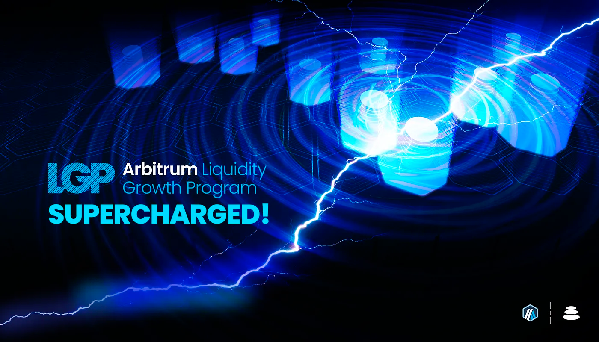
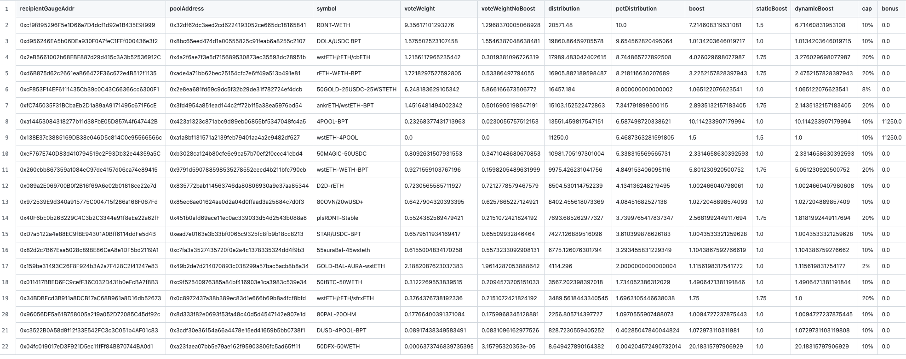
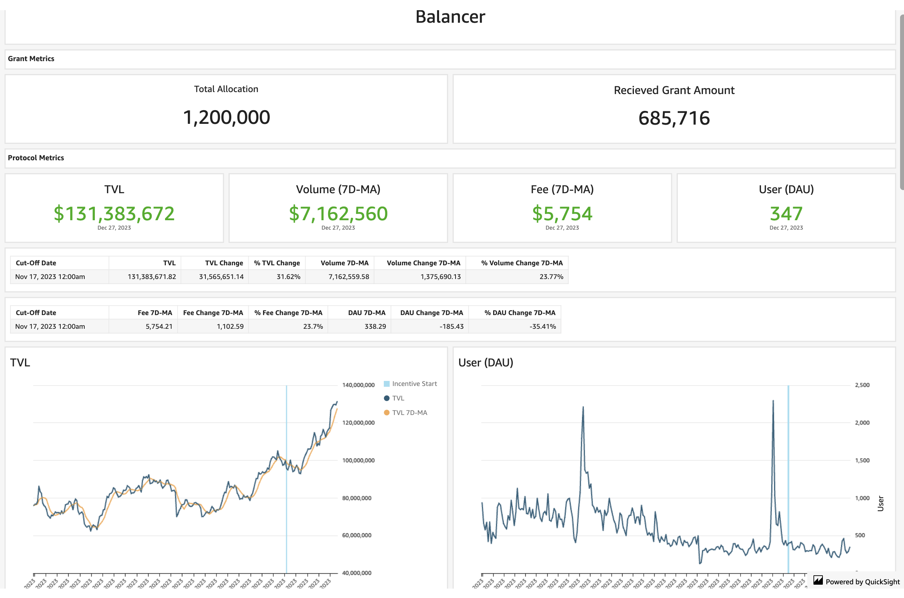
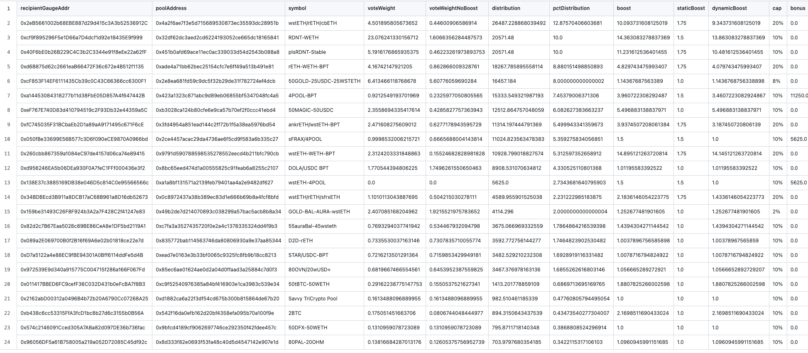

As per the STIP rules all protocols must post bi-weekly forum updates. The second updates will be due by this Friday, December 29th at 12:00PM EST

# Balancer Bi-Weekly Update 29-12-2023

## Recap of the Previous Two Weeks

**ARB Received Last Disbursement:** 342,858 (KYC delays resulted in collecting 2 biweekly payments at the start of the program, details in change section below)

**ARB Utilized as Incentives in the Last Two Weeks: [205,249](https://arbiscan.io/tx/0x24488fd95589c8f78077c517862011b1a1531d2ccb6e8b49367d1cf11aeacd7f)

**Contracts incentivized over the last 2 weeks:** A CSV of incentived along with details about $ARB flows to each one and how they were calculated can be found [here](https://github.com/BalancerMaxis/data_automation/blob/main/notebooks/arb_dao_grant_distribution/output/dao_grant_2023-11-16_2023-11-30.csv).
These amounts of payment were queued and the required 171,429 $ARB sent for payment by this [multisig transaction](https://app.onchainden.com/safes/arb1:0xb6BfF54589f269E248f99D5956f1fDD5b014D50e/transactions/0x7e550b33e7fd3efe670263fab17448f20a68e8e5054dafb48b5b885c2012faf1) executed at 20:43 UTC on Friday December 15th.
These payments will be streamed to stakers in the gauge by the injector and the gauge system for 2 weeks, ending today on December 15th.

**Contract address label [Form](https://docs.google.com/forms/d/e/1FAIpQLSd2AYnjAaQjVOLtvemZpsWoN5sTJEJ8dLqdRDExTBQv_SUeug/viewform) completed for all addresses:** Yes

**ARB left over:** 102,857.4

**Plan for leftover ARB:** The leftover ARB will be paid out over the following rounds as described in prior reports by distributing 205,714.8 for the remaining periods. The incentive amount coupled with favorable market conditions have led to a large increase in productive TVL on Balancer which will be outlined in detail in the summary section. The plan for Balancer is the same as it has been from the start, continue to target liquid staking derivatives for Ethereum and create a sticky liquidity cycle on the Arbitrum network. 

Drilling down on this point, Balancer continues to expand the diversity on Arbitrum with new yield bearing assets each round. Ethereum LSTs will cotninue to thicken as the core pool flywheel is amplified by ARB, and plsRDNT has began to take off on Balancer as the hub for permalocked Radiant dlp. The next yield bearing asset to keep an eye out for is sFRAX, a stablecoin which will quietly begin to take over the market on Balancer with yield for our set and forget LPs to be able to count on as a capital efficient core pool. 

**Summary of incentives:** Incentives were dispersed based on the CSV above, which shows where the ARB was sent based upon the plan outlined in [Balancer's FINAL STIP Round 1 framework](https://forum.arbitrum.foundation/t/balancer-final-stip-round-1/16689). As mentioned in the prior report, there was a correction made to the dynamic boost which pushes a larger share of incentives towards the higher performing pools in terms of fees earned. This, like the Balancer core pool models is one of the layers of optimization engineering our team works on day in and day out. This round has seen a much more efficient direction of incentives, and we can see the results begin to take affect. Our team is excited to see this adjustment continue to unfold on the network. 

Looking back at where we were on December 15th, there have been healthy developments throughout the pools which were top earners last round. The Aura ecosystem has been instrumental in bringing partners like Plutus and Radiant up to speed quickly and efficiently, and we expect them to continue to do so as sFRAX comes further into the picture. To maintain the same comparison from last round we will look at the same pools; with some additional ones joining the center stage. The [RDNT/WETH](https://app.balancer.fi/#/arbitrum/pool/0x32df62dc3aed2cd6224193052ce665dc181658410002000000000000000003bd) pool increased from 60MM to 74MM TVL and the average volume is mainting for now, this week at 1.15MM from 1.19 MM per day last round. Looking at the same liquid staking derivative pools from last round [cbETH/rETH/wstETH](https://app.balancer.fi/#/arbitrum/pool/0x4a2f6ae7f3e5d715689530873ec35593dc28951b000000000000000000000481), [WETH/rETH](https://app.balancer.fi/#/arbitrum/pool/0xade4a71bb62bec25154cfc7e6ff49a513b491e81000000000000000000000497), [wstETH/WETH](https://app.balancer.fi/#/arbitrum/pool/0x9791d590788598535278552eecd4b211bfc790cb000000000000000000000498) and [ankrETH/wstETH](https://app.balancer.fi/#/arbitrum/pool/0x3fd4954a851ead144c2ff72b1f5a38ea5976bd54000000000000000000000480) have reached all time highs, with no exceptions. Our newest LST pool [sfrxETH/wstETH/rETH](https://app.balancer.fi/#/arbitrum/pool/0x0c8972437a38b389ec83d1e666b69b8a4fcf8bfd00000000000000000000049e) is not only at it's all time high, but has already reached 1MM in TVL. We expect these pools to continue to grow and facilitate large amounts of volume throughout the Arbitrum network. 

The total ETH LST TVL is over 47.5MM at this point, for reference the previous round was 37.15MM (stable pools plus weighted portions) and volume for the two week period in the 5 mentioned stable LST pools is roughly 38.6MM while last round was 34.75MM. We expect these pools to continuously grow, and the fee on their yield bearing portion makes them extremely strong footholds for the DAO and LPs to thrive together in building. 

The pools dedicated to routing liquidity on Balancer supported by the ARB STIP are the 4POOL and the 4POOL/wstETH pair. The [4POOL](https://app.balancer.fi/#/arbitrum/pool/0x423a1323c871abc9d89eb06855bf5347048fc4a5000000000000000000000496) pool has has increased another 5% at time of writing in TVL to 5.15MM in the two week span and is averaging 1.9MM compared to previously 2.2MM in volume per day. The [4POOL/wstETH](https://app.balancer.fi/#/arbitrum/pool/0xa1a8bf131571a2139feb79401aa4a2e9482df6270002000000000000000004b4) pool is at it's all time high, just under 1.2MM in TVL. The volume over a two week period is holding steady at 500k for both this period and 500k for the previous. 

Two pools we mentioned to focus on for this upcoming round were [plsRDNT](https://app.balancer.fi/#/arbitrum/pool/0x451b0afd69ace11ec0ac339033d54d2543b088a80000000000000000000004d5) and the [sfrxETH tripool](https://app.balancer.fi/#/arbitrum/pool/0x0c8972437a38b389ec83d1e666b69b8a4fcf8bfd00000000000000000000049e). Both pools have climbed in TVL quickly this round with the plsRDNT pool at 800k TVL and sfrxETH tripool just over 1MM in 100% liquid staking derivatives of ETH. These pools are high fee earners in terms of organic yield from the underlying assets. We expect both of these pools to continue to scale up in the coming rounds. 

Stats from [Openblock Dashboard](https://www.openblocklabs.com/app/arbitrum/grantees/Balancer):

**Additional Info / Disclosures to Multisig:** 

- Tags for each contract address can be found in the csv above.
- See previous report for any comments on the current payment schematic of ARB to align with the deadline of the incentive cycle end proposed by the Arbitrum Foundation.
- Details can be seen on [this sheet](https://docs.google.com/spreadsheets/d/1k4i9ZNpxiRDC_bl4JtZMldV7J0LRQEVHZNqVpj8xG0g/edit#gid=0)

## STATS

**Link to Dashboard showing metrics:** [Balancer Arbitrum Liquidity Growth Program dashboard](https://dune.com/balancer/arbitrum-lgp?End+date_daf146=&Start+date_d2264d=&End+date_d75e58=2023-12-28+00%3A00%3A00&Start+date_d524c0=2023-12-15+00%3A00%3A00)

**Average daily TVL:** $121,744,263

**Average daily transactions:** 606

**Average daily volumes:** $6,684,114

**Number of unique user addresses:** 3030

**Transaction fees:** Average daily: $10,795

## Plan For the Next Two Weeks

**Amount of ARB to be distributed:** 205,714.8

**Contracts that will be incentivized:** Contracts to be incentivied are outlined in this [csv](https://github.com/BalancerMaxis/STIP_automation/blob/last-round-2023/output/dao_grant_2023-12-14_2023-12-28.csv), subject to change as more gauges are added to the veBAL system on Arbitrum.

**Contract address label [Form](https://docs.google.com/forms/d/e/1FAIpQLSd2AYnjAaQjVOLtvemZpsWoN5sTJEJ8dLqdRDExTBQv_SUeug/viewform) completed for all addresses:** Yes

**Mechanism for distribution incentives:** Distributions will be done every week via Balancer DAO's [ARB injector contract](https://arbiscan.io/address/0xF23d8342881eDECcED51EA694AC21C2B68440929#readContract) by sending direct incentives to the gauges of the respective pools in the Balancer ecosystem.

**Summary of incentives plan:** The incentives structure will continue to be carried out as planned since the original awarding of the STIP. As new pools join the ecosystem there will be competition between the most efficient ones on a fee per emission basis to determine where the majority of incentives are directed. More efficient pools receive more incentives and over time facilitate the optimal use of ARB for the liquidity hosted by Balancer on Arbitrum. As new strong contendors join the ecosystem the competition becomes more fierce between pools, ultimatley leading to more TVL, fees, and diversity on the platform.

The newest pools to look out for this round are those which have sFRAX in them, the yield bearing staked FRAX stablecoin in them. Yield bearing stablecoins addd a layer of capital efficiency for LPs where they are risk off in a dollars denominated sense, but accrue yield on their position. The two pools which will be incentivized this upcoming round are the [sFRAX/4POOL](https://app.balancer.fi/#/arbitrum/pool/0x2ce4457acac29da4736ae6f5cd9f583a6b335c270000000000000000000004dc) and [sFRAX/wstETH](https://app.balancer.fi/#/arbitrum/pool/0xc757f12694f550d0985ad6e1019c4db4a803f1600002000000000000000004de), offering more organic yield for users than a typical stablecoin pool or stablecoin/WETH pairing. We look forward to the adoption of Frax into our ecosystems, and expect these pools to be popular in the near future. 

**Summary of changes to the original plan:** As stated in prior reports, biweekly distributions are 205714.2 $ARB in order to pay out the full amount before February 15th as requested. The original proposal will be carried out as planned, with additional gauges as they approved by Balancer governance. 

There has been one change which is not major, but tips the scale further in favor of productive liqudity which are useful to both Arbitrum and Balanceer. Last week, Balancer passed [BIP-522](https://forum.balancer.fi/t/bip-522-arbitrum-lgp-and-stip-adjustments/5473) which essentially changes the boosting system of the ARB STIP program. Without changing the core logic, the BIP changes the automation to boost productive liquidity 3x more in order terms of distribution of ARB rewards. The goal being to prevent low performance pools from gaining high amounts of incentives without producing a high amount of fees. 

The fixed incentives which were initially directed at the 4POOL and wstETH/4POOL will now be pointed towards the sFRAX/4POOL and sFRAX/wstETH pool in order to leverage the interest bearing nature of sFRAX for LPs. This make the adoption of Frax into the ecosystem much more streamlined, while earning more passive yield for LPs. With these changes in place, we intend to push the desirable outcomes of the Arbitrum Foundation, namely productive TVL, volume, and fees upwards by reaffirming that ARB will be sent to useful pools. 