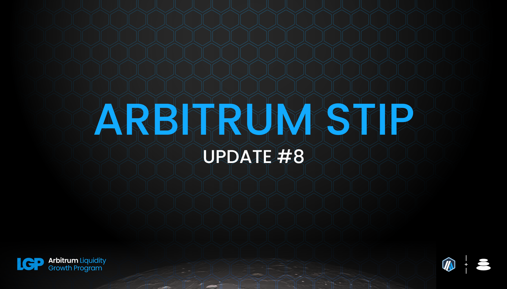
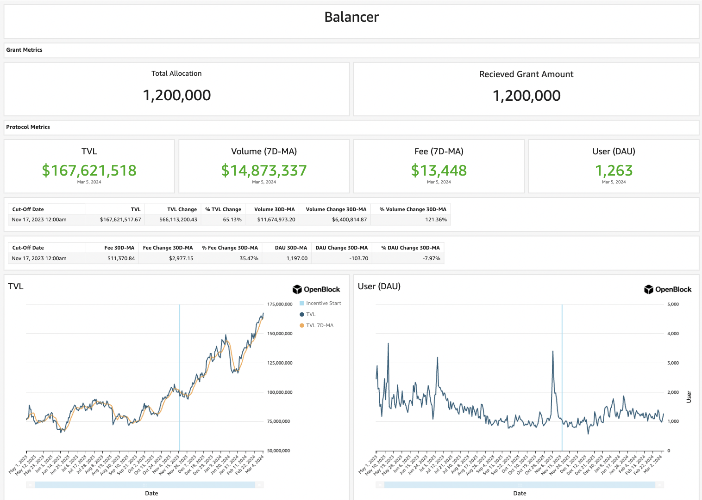

As per the STIP rules all protocols must post bi-weekly forum updates. The second updates will be due by this Friday, March 8th at 12:00PM EST

# Balancer Bi-Weekly Update 8-3-2024

## Recap of the Previous Two Weeks

**ARB Received Last Disbursement:** 0 (KYC delays resulted in collecting 2 biweekly payments at the start of the program, details in change section below)

**ARB Utilized as Incentives in the Last Two Weeks: [82,285.3](https://arbiscan.io/tx/0x11929aeec61ae0883ec0d7f1f40fb51cae2e21c8c327cf6841a1fd0941b1efc7)

**Contracts incentivized over the last 2 weeks:** A CSV of incentived along with details about $ARB flows to each one and how they were calculated can be found [here](https://github.com/BalancerMaxis/multisig-ops/pull/813/files#diff-4e4862b4eeedd46dd2a70206c43e27a92bcc47f51e274de8572197ec828e9e5b).
These amounts of payment were queued and the required 82,285.3 $ARB sent for payment by this [multisig transaction](https://app.onchainden.com/safes/arb1:0xb6BfF54589f269E248f99D5956f1fDD5b014D50e/transactions/0x1e2068ad73a12c9b04f21bf29e285ff13056bd9016f4b4f692848dfbcac628f8) executed at 14:32 UTC on Friday February 23rd.
These payments were be streamed to stakers in the gauge by the injector and the gauge system for 2 weeks, ending today on March 8th.

**Contract address label [Form](https://docs.google.com/forms/d/e/1FAIpQLSd2AYnjAaQjVOLtvemZpsWoN5sTJEJ8dLqdRDExTBQv_SUeug/viewform) completed for all addresses:** Yes

**ARB left over:** 82,285.4

**Plan for leftover ARB:** The left over ARB is the last batch of STIP incentives Balancer will distribute to liqudity providers over the next 2 weeks. This will conlcude on March 22nd. As has been the structure for Balancer's distribution for the entirety of the program, the highest revenue generating pools receive the highest amount of ARB and BAL incentives via the corep ool system. This drives incentives towards the pools which make a largest impact on the network and dex aligned for peak efficiency. 

**Summary of incentives:** Incentives were sent to each pool's respective gauge based on [Balancer's FINAL STIP Round 1 framework](https://forum.arbitrum.foundation/t/balancer-final-stip-round-1/16689). ARB incentives have been sent to pool's on Balancer corresponding to their performance over the last several months. The top BAL receivers are the top earners in majority of cases, and fee revenue amiplifies the allocation of BAL and ARB that value add pools receive in the Balancer ecosystem. The core pool flywheel has proven to be effective for the protocol and we have seen it continue to be a success throughout the ARB STIP by driving TVL and fee metrics higher, while also paving the way for integrations on top of Balancer and Arbitrum to blossom.

Last epoch, TVL on Balancer was 141MM and has since broke ATH's this round reaching 167MM. The value in ETH has increased slightly due to the market sentiment. The shear stickiness of liquidity on Balancer after incentives were first tapered down and now with TVL jumping so drastically the draw of rewards has mostly fizzled away. Liquidity providers at this point are on Balancer and Arbitrum for the safety, efficienct mechanics, and long term belief in both ecosystems success.

As we have done in every report thus far we will highlight the top performing pools in relation to their past epoch. [RDNT/WETH](https://app.balancer.fi/#/arbitrum/pool/0x32df62dc3aed2cd6224193052ce665dc181658410002000000000000000003bd) reaches is all time high ever at 94MM with the prior week coming in at 81MM. For those projects debating the proper governance system to utilize for sound tokenomics, the ve80/20 continues to prove itself as a viable route. The last two rounds ahd underwhelming average daily volume metrics, both under 1MM per day. This epoch though the average daily volume was 1.8MM having on of it's best epochs thus far. 

The LST portion of this report will change because of the migration last round of several rETH pools due to minor issue related to the rETH token's rate provider contract. The first three pools are currently undergoing migrations but still maintain TVL for the time being. [cbETH/rETH/wstETH](https://app.balancer.fi/#/arbitrum/pool/0x4a2f6ae7f3e5d715689530873ec35593dc28951b000000000000000000000481), [WETH/rETH](https://app.balancer.fi/#/arbitrum/pool/0xade4a71bb62bec25154cfc7e6ff49a513b491e81000000000000000000000497), and [sfrxETH/wstETH/rETH](https://app.balancer.fi/#/arbitrum/pool/0x0c8972437a38b389ec83d1e666b69b8a4fcf8bfd00000000000000000000049e) have all dropped in TVL and total ETH terms as expected since LPs should be exiting; however they are still sizeable with 11MM, 9.6MM, and 4.9MM TVL respectively. They're migrations are to be moved to the following pools:
[rETH/wETH](https://app.balancer.fi/#/arbitrum/pool/0xd0ec47c54ca5e20aaae4616c25c825c7f48d40690000000000000000000004ef) which already has 2MM TVL.
[wstETH/sfrxETH](https://app.balancer.fi/#/arbitrum/pool/0xc2598280bfea1fe18dfcabd21c7165c40c6859d30000000000000000000004f3) at 1.3MM. 
[cbETH/wstETH/rETH](https://app.balancer.fi/#/arbitrum/pool/0x2d6ced12420a9af5a83765a8c48be2afcd1a8feb000000000000000000000500) and 2.9MM.
This in total is an improvement in TVL when adding up the fragment portions compared to the last round. 
[wstETH/WETH](https://app.balancer.fi/#/arbitrum/pool/0x9791d590788598535278552eecd4b211bfc790cb000000000000000000000498) and [ankrETH/wstETH](https://app.balancer.fi/#/arbitrum/pool/0x3fd4954a851ead144c2ff72b1f5a38ea5976bd54000000000000000000000480) have both hit all time highs in USD terms but the wstETH/wETH pool has seen a minor drawback in ETH terms, while the ankr pool has continued to grow in both senses. 

ETH LST TVL was 50MM in USD terms last round, and due to the market taking a large upward move Balancer's LST TVL sits now at 57MM (stable pools plus weighted portions. Volume for these pools was 53.7MM led primarily by the wstETH/wETH pool with 35.6MM volume on it's own. This epoch the total has tapered to 47.5MM. Given the circumstances this exemplifies the strength of Balancer's infrastructure and strategy resulting in beneficial aligned outcomes for Arbitrum. 

Balancer Maxis continue to incentivize the 4POOL for core stablecoin routing using their vlAura holdings. The [4POOL](https://app.balancer.fi/#/arbitrum/pool/0x423a1323c871abc9d89eb06855bf5347048fc4a5000000000000000000000496) pool has decreased from 3.6MM to 3.1MM TVL and still sees significant volume, consistent with the value of over 100% utilization on average per day this epoch. 

The [sFRAX/4POOL](https://app.balancer.fi/#/arbitrum/pool/0x2ce4457acac29da4736ae6f5cd9f583a6b335c270000000000000000000004dc) pool has stayed exactly at 3.3MM TVL likely due to market conditions defi users are deploying stable capital back into markets making the barrier for entry on stable coin yield higher than it was previously. The sFRAX/4POOL remains a competitive place for LPs to confidentatly supply liquidity and receive modest incentives. Regardless, the volume in the 4POOL has not seen a significant drop so intended efficieny has not been sacrificed substantially. 

Stats from [Openblock Dashboard](https://www.openblocklabs.com/app/arbitrum/grantees/Balancer):

**Additional Info / Disclosures to Multisig:** 

- Tags for each contract address can be found in the csv above.
- See previous report for any comments on the current payment schematic of ARB to align with the deadline of the incentive cycle end proposed by the Arbitrum Foundation.
- Details can be seen on [this sheet](https://docs.google.com/spreadsheets/d/1k4i9ZNpxiRDC_bl4JtZMldV7J0LRQEVHZNqVpj8xG0g/edit#gid=0)

## STATS

**Link to Dashboard showing metrics:** [Balancer Arbitrum Liquidity Growth Program dashboard](https://dune.com/balancer/arbitrum-lgp?End+date_daf146=&End+date_d75e58=2023-12-28+00%3A00%3A00&Start+date_d2264d=&End+date_d85b75=2024-02-08+00%3A00%3A00&End+date_d19c82=2024-02-08+00%3A00%3A00&Start+date_dc9002=2024-01-26+00%3A00%3A00&Start+date_dfbf60=2024-01-26+00%3A00%3A00&End+date_d9e9d1=2024-03-07+00%3A00%3A00&Start+date_d524c0=2024-02-23+00%3A00%3A00)

**Average daily TVL:** $167,621,518

**Average daily transactions:** 516

**Average daily volumes:** $14,873,337

**Number of unique user addresses:** 2,641

**Transaction fees:** Average daily: $13,448

## Plan For the Next Two Weeks

**Amount of ARB to be distributed:** 82285.3

**Contracts that will be incentivized:** Contracts to be incentivied are outlined in this [csv](https://github.com/BalancerMaxis/multisig-ops/pull/813/files#diff-4e4862b4eeedd46dd2a70206c43e27a92bcc47f51e274de8572197ec828e9e5b), subject to change as more gauges are added to the veBAL system on Arbitrum.

**Contract address label [Form](https://docs.google.com/forms/d/e/1FAIpQLSd2AYnjAaQjVOLtvemZpsWoN5sTJEJ8dLqdRDExTBQv_SUeug/viewform) completed for all addresses:** Yes

**Mechanism for distribution incentives:** Distributions will be done every week via Balancer DAO's [ARB injector contract](https://arbiscan.io/address/0xF23d8342881eDECcED51EA694AC21C2B68440929#readContract) by sending direct incentives to the gauges of the respective pools in the Balancer ecosystem.

**Summary of incentives plan:** Balancer's data based core pool process optimizes the incentives throughout the ecosystem and has been continuosuly improved for the Arbitrum STIP. Amplifying high revenue generating pool's share of the ARB Balancer was generously given has been streamlined to create an upward spiraling liquidity trend. 

The program will eventually end, concluding in March and Balancer will maintain a large amount of the liquidity it has built up from the STIP. Yield bearing tokens will continue to be incentivized by their own revenue generation and the layers built on top of Balancer will leverage various underlying yield sources to make LPing on the platform as competitive as possible in the Arbitrum ecosystem.

**Summary of changes to the original plan:** Bi-weekly distributions will continue82285.3 per round due to the extension plan in place from the Arbitrum Foundation. This will make the program last through the first half of March. The optimization BIP details to strengthen top performing pool's can be seen here [BIP-522](https://forum.balancer.fi/t/bip-522-arbitrum-lgp-and-stip-adjustments/5473).