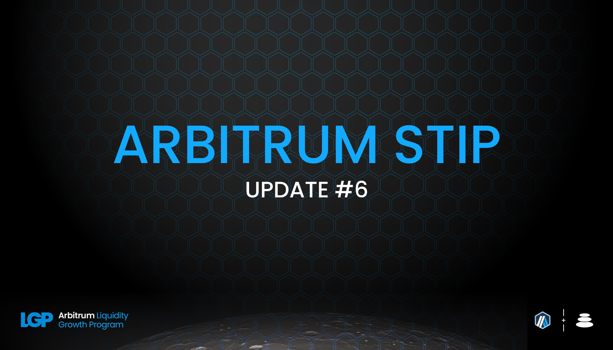
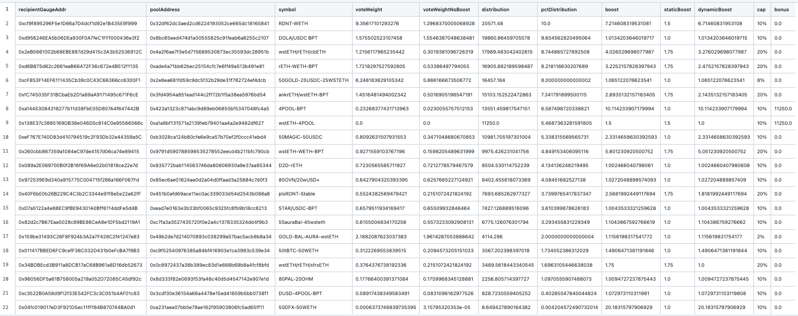
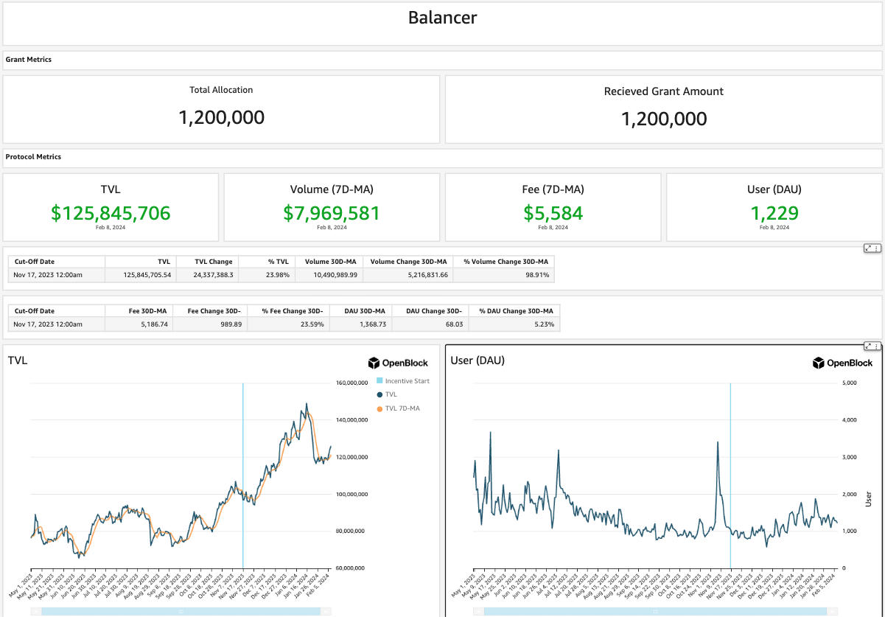

As per the STIP rules all protocols must post bi-weekly forum updates. The second updates will be due by this Friday, February 9th at 12:00PM EST

# Balancer Bi-Weekly Update 9-2-2024

## Recap of the Previous Two Weeks

**ARB Received Last Disbursement:** 171,429 (KYC delays resulted in collecting 2 biweekly payments at the start of the program, details in change section below)

**ARB Utilized as Incentives in the Last Two Weeks: [82,285.3](https://arbiscan.io/tx/0x2e245239bbbce3fc36dc756e3be61377be6d6791add3d6debfddff067554a19d)

**Contracts incentivized over the last 2 weeks:** A CSV of incentived along with details about $ARB flows to each one and how they were calculated can be found [here](https://github.com/BalancerMaxis/STIP_automation/blob/main/output/dao_grant_2024-01-11_2024-01-25.csv).
These amounts of payment were queued and the required 82,285.3 $ARB sent for payment by this [multisig transaction](https://app.onchainden.com/safes/arb1:0xb6BfF54589f269E248f99D5956f1fDD5b014D50e/transactions/0xfc3f1a16b42153e914bed4344bb5299ec9ff70f5d88c7a9f50391b4554237034) executed at 15:24 UTC on Friday January 26th.
These payments were be streamed to stakers in the gauge by the injector and the gauge system for 2 weeks, ending today on February 9th.

**Contract address label [Form](https://docs.google.com/forms/d/e/1FAIpQLSd2AYnjAaQjVOLtvemZpsWoN5sTJEJ8dLqdRDExTBQv_SUeug/viewform) completed for all addresses:** Yes

**ARB left over:** 246,856

**Plan for leftover ARB:** The leftover ARB will be distributed out until through the month of March. The Balancer DAO is distributing 82285.3 ARB per round until March 8. This final injection would then last until March 22 for ARB streamign to close out Balancer's STIP cycle. 

This injection was the second round of scaled back ARB incentives and will be the status quo until the STIP is concluded at the end of Q1. As mentioned in the previous report the resulting performance of Balancer after scaling back on incentives is an indicator of how the STIP has provided lasting value. Due to Balancer's core pool mechanics once liquidity is present and healthy, it will receive a fair market amount of incentives in the form of BAL and AURA enticing new users to stay on the platform. This aligns the interested of Arbitrum and Balancer as well as the humble liquidity providers we are both looking to attract. 

**Summary of incentives:** Incentives were injected to pool gauge's based on the CSV above, which shows where the ARB was sent based upon the plan outlined in [Balancer's FINAL STIP Round 1 framework](https://forum.arbitrum.foundation/t/balancer-final-stip-round-1/16689). The incentives continue to flow towards the highest revenue earning pools in terms of total fees. This encompasses yield and swap fees generated for LPs and rewards the healthiest pools in the ecosystem. Arbitrum and Balancer both continue to benefit from the liquidity incentives maintaining the TVL it attracted in the earlier phases of the STIP. This round displays a good indication relative to the prior weeks of how Balancer will perform on Arbitrum as ARB rewards scale back and settle in for liquidity providers.

The TVL at the time of writing the previous report was 119M total, and this has stayed consistent as the average daily TVL over the last two weeks. Today the TVL on Balancer is 121M and we can thank the integrations built on top of and within Balancer for optimizing liquidity strategies in throughout the Arbitrum ecosystem for this. Balancer acting as base layer for yield optimizing protocols to tie into is how our dex brings great value to a network like Arbitrum. Regardless of the 60% reduction in incentives TVL has taken a minor step down since its peak one month ago, and this is also related to the overall market conditions pulling back. In ETH terms Balancer is still near its all time high TVL throughout the STIP. 

To remain consistent here are the statistics of Balancer's top performing pools in comparison to the previous epoch. [RDNT/WETH](https://app.balancer.fi/#/arbitrum/pool/0x32df62dc3aed2cd6224193052ce665dc181658410002000000000000000003bd) is holding steady at 68MM up slightly from last weeks 64MM. Radiant has been a powerful partner for Balancer and our 80/20 model has played a key role in the success of their on chain liquid locking tokenomics. The last round had average daily volumes 1.18MM in daily volume, and currently RDNT has been relatively low volatility making the average daily volume 0.25MM per day. Looking at the same liquid staking derivative pools [cbETH/rETH/wstETH](https://app.balancer.fi/#/arbitrum/pool/0x4a2f6ae7f3e5d715689530873ec35593dc28951b000000000000000000000481), [WETH/rETH](https://app.balancer.fi/#/arbitrum/pool/0xade4a71bb62bec25154cfc7e6ff49a513b491e81000000000000000000000497), [wstETH/WETH](https://app.balancer.fi/#/arbitrum/pool/0x9791d590788598535278552eecd4b211bfc790cb000000000000000000000498) and [ankrETH/wstETH](https://app.balancer.fi/#/arbitrum/pool/0x3fd4954a851ead144c2ff72b1f5a38ea5976bd54000000000000000000000480) have stayed relatively the same in TVL since the last round, not breaking the all time highs of two rounds ago, however the ankrETH pool did run up to a new ATH.[cbETH/rETH/wstETH](https://app.balancer.fi/#/arbitrum/pool/0x4a2f6ae7f3e5d715689530873ec35593dc28951b000000000000000000000481) has maintained it's large rapid increase in TVL with a steady hold of roughly 12MM. [sfrxETH/wstETH/rETH](https://app.balancer.fi/#/arbitrum/pool/0x0c8972437a38b389ec83d1e666b69b8a4fcf8bfd00000000000000000000049e) jumped quickly up to 5.48MM in just four weeks and is now sitting at 5.37MM with its highest ETH holdings to date.

ETH LST TVL has been climbed consistently over the last two months on Balancer and reached just under 52MM TVL last round. This round we are happy to report 60MM for this same set of assets at the time of writing (stable pools plus weighted portions. This is a net increase in ETH from the previous round, and reflects a slightly higher price point for ETH. Volume across these pools for the previous 2 week period was 38MM and this round did not see a major change holding at just over 35MM in volume. Given the circumstances this exemplifies the strength of Balancer's infrastructure and strategy resulting in beneficial aligned outcomes for Arbitrum. 

Last round the ARB incentives were cut from the 4POOL and the 4POOL/wstETH pair. The [4POOL](https://app.balancer.fi/#/arbitrum/pool/0x423a1323c871abc9d89eb06855bf5347048fc4a5000000000000000000000496) pool has increased from 5.47MM to 6.28MM TVL without any direct incentivization and still sees significant volume, averaging 4.28MM per day this round. The nesting of the 4POOL agaisnt sFRAX is proven to be more efficienct for Balancer liquidity providers and the Arbitrum Foundation's STIP funding based on this outcome continuing to outperform competing dexes. 

The [sFRAX/4POOL](https://app.balancer.fi/#/arbitrum/pool/0x2ce4457acac29da4736ae6f5cd9f583a6b335c270000000000000000000004dc) pool has jumped again from 5MM to 6.1MM TVL and remains a comepetitive place for LPs to park their liquidity and indirectly facilitate the throughput the 4POOL is able to produce. This pool gives LPs yield from the sFRAX token accruing over time, and additional incentives from BAL and AURA because of the core pool cycle it wields due to sFRAX.

Stats from [Openblock Dashboard](https://www.openblocklabs.com/app/arbitrum/grantees/Balancer):

 ## NEEEDS UPDATE BY OPENBLOCK

**Additional Info / Disclosures to Multisig:** 

- Tags for each contract address can be found in the csv above.
- See previous report for any comments on the current payment schematic of ARB to align with the deadline of the incentive cycle end proposed by the Arbitrum Foundation.
- Details can be seen on [this sheet](https://docs.google.com/spreadsheets/d/1k4i9ZNpxiRDC_bl4JtZMldV7J0LRQEVHZNqVpj8xG0g/edit#gid=0)

## STATS

**Link to Dashboard showing metrics:** [Balancer Arbitrum Liquidity Growth Program dashboard](https://dune.com/balancer/arbitrum-lgp?Start+date_d524c0=2023-12-15+00%3A00%3A00&End+date_daf146=&End+date_d75e58=2023-12-28+00%3A00%3A00&Start+date_d2264d=&End+date_d85b75=2024-02-08+00%3A00%3A00&End+date_d19c82=2024-02-08+00%3A00%3A00&Start+date_dc9002=2024-01-26+00%3A00%3A00&Start+date_dfbf60=2024-01-26+00%3A00%3A00)

**Average daily TVL:** $118,887,122

**Average daily transactions:** 507

**Average daily volumes:** $7,789,287

**Number of unique user addresses:** 3410

**Transaction fees:** Average daily: $5,556

## Plan For the Next Two Weeks

**Amount of ARB to be distributed:** 82285.3

**Contracts that will be incentivized:** Contracts to be incentivied are outlined in this [csv](https://github.com/BalancerMaxis/STIP_automation/blob/main/output/dao_grant_2024-01-11_2024-01-25.csv), subject to change as more gauges are added to the veBAL system on Arbitrum.

**Contract address label [Form](https://docs.google.com/forms/d/e/1FAIpQLSd2AYnjAaQjVOLtvemZpsWoN5sTJEJ8dLqdRDExTBQv_SUeug/viewform) completed for all addresses:** Yes

**Mechanism for distribution incentives:** Distributions will be done every week via Balancer DAO's [ARB injector contract](https://arbiscan.io/address/0xF23d8342881eDECcED51EA694AC21C2B68440929#readContract) by sending direct incentives to the gauges of the respective pools in the Balancer ecosystem.

**Summary of incentives plan:** The plan for incentives has been the same for the entirety of the STIP. Balancer uses data driven processes to optimize the incentives it wields from BAL, AURA, and in this case ARB to drive the most profitable pools in terms of yield and swap fees to become more heavily incentivized. As the draw for new liquidity providers strengthens a fly wheel on each pool is organically constructed and the strong pools maintain themselves benefitting the Arbitrum network users with more competitive pricing for swaps, and liquidity providers in high demand pairings to be properly compensated for their positions. 

This will continue through the end of March and Balancer will be holding on to a large amount of the liquidity it has built up from the STIP long after it ends simply because of the healthy architecture it has beneath it's surface. The yield bearing assets, all LSTs, plsRDNT, and sFRAX will continue to be at the forefront for Balancer and Arbitrum users will likely end up in these pools sooner or later because of their long lasting flywheel. 

**Summary of changes to the original plan:** Bi-weekly distributions will be 82285.3 per round due to the extension plan in place from the Arbitrum Foundation. This will make the program last through the first half of March. The optimization BIP details to strengthen top performing pool's can be seen here [BIP-522](https://forum.balancer.fi/t/bip-522-arbitrum-lgp-and-stip-adjustments/5473).